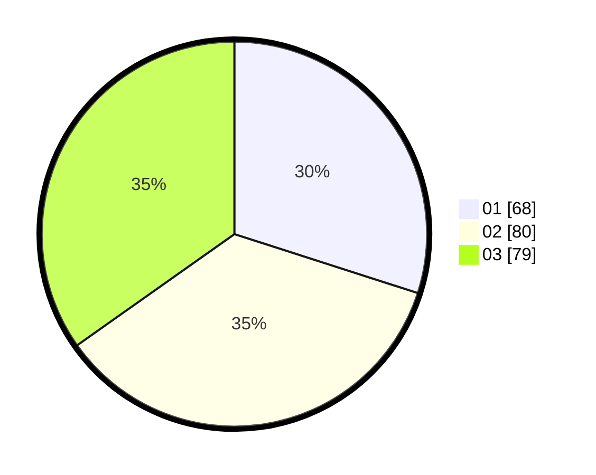

# Hasil

Hasil perolehan suara paslon dapat dilihat pada file paslon-01.txt, paslon-02.txt, dan paslon-03.txt.

Jika tidak ada, artinya data tersebut belum ada pada SIREKAP.

## Perolehan Suara

 * Paslon 01: **68**.
 * Paslon 02: **80**.
 * Paslon 03: **79**.

## Foto C Plano

https://sirekap-obj-formc.kpu.go.id/fc8d/pemilu/ppwp/31/73/08/10/02/3173081002123-20240214-193101--7313ff8c-302a-43ed-836e-6b4b110b15a0.jpg

https://sirekap-obj-formc.kpu.go.id/fc8d/pemilu/ppwp/31/73/08/10/02/3173081002123-20240214-193305--498ed948-8cc2-4849-b7d1-e4ae25edc425.jpg

https://sirekap-obj-formc.kpu.go.id/fc8d/pemilu/ppwp/31/73/08/10/02/3173081002123-20240214-193420--5201f448-9d15-4242-ba10-a7a3eba160d8.jpg

## DATA PEMILIH TETAP

Jumlah pemilih dalam DPT: **271**.
 * L: **135**.
 * P: **136**.

## DATA PENGGUNA HAK PILIH

Jumlah pengguna hak pilih dalam DPT: **215**.
 * L: **107**.
 * P: **108**.

Jumlah pengguna hak pilih dalam DPTb: **3**.
 * L: **3**.
 * P: **0**.

Jumlah pengguna hak pilih dalam DPK: **9**.
 * L: **5**.
 * P: **4**.

Jumlah pengguna hak pilih: **227**.
 * L: **115**.
 * P: **112**.

## JUMLAH SUARA SAH DAN TIDAK SAH

JUMLAH SELURUH SUARA SAH: **277**.

JUMLAH SUARA TIDAK SAH: **0**.

JUMLAH SELURUH SUARA SAH DAN SUARA TIDAK SAH: **277**.
