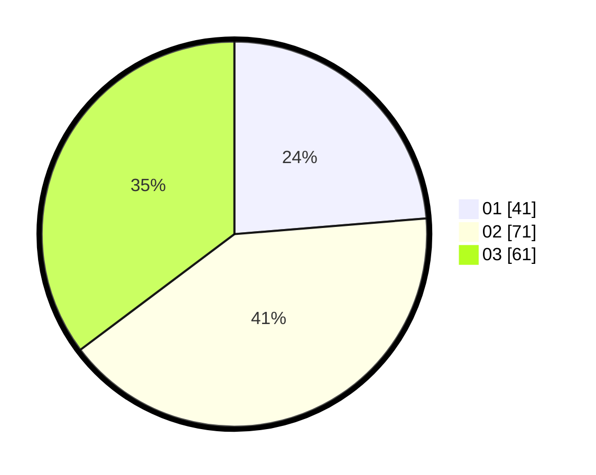

# Hasil

Hasil perolehan suara paslon dapat dilihat pada file paslon-01.txt, paslon-02.txt, dan paslon-03.txt.

Jika tidak ada, artinya data tersebut belum ada pada SIREKAP.

## Perolehan Suara

 * Paslon 01: **41**.
 * Paslon 02: **71**.
 * Paslon 03: **61**.

## Foto C Plano

https://sirekap-obj-formc.kpu.go.id/f3a8/pemilu/ppwp/31/73/08/10/02/3173081002125-20240214-160121--5bcdaf07-e1a3-440d-8b79-cf34c3b6050e.jpg

https://sirekap-obj-formc.kpu.go.id/f3a8/pemilu/ppwp/31/73/08/10/02/3173081002125-20240214-160117--fa301d57-d659-42b2-9ad4-5150ba3a087d.jpg

https://sirekap-obj-formc.kpu.go.id/f3a8/pemilu/ppwp/31/73/08/10/02/3173081002125-20240216-020355--052c1438-ea27-4859-97ac-4b2c960165d2.jpg

## DATA PEMILIH TETAP

Jumlah pemilih dalam DPT: **207**.
 * L: **107**.
 * P: **107**.

## DATA PENGGUNA HAK PILIH

Jumlah pengguna hak pilih dalam DPT: **267**.
 * L: **25**.
 * P: **82**.

Jumlah pengguna hak pilih dalam DPTb: **4**.
 * L: **3**.
 * P: **0**.

Jumlah pengguna hak pilih dalam DPK: **4**.
 * L: **1**.
 * P: **3**.

Jumlah pengguna hak pilih: **175**.
 * L: **89**.
 * P: **86**.

## JUMLAH SUARA SAH DAN TIDAK SAH

JUMLAH SELURUH SUARA SAH: **173**.

JUMLAH SUARA TIDAK SAH: **2**.

JUMLAH SELURUH SUARA SAH DAN SUARA TIDAK SAH: **175**.
