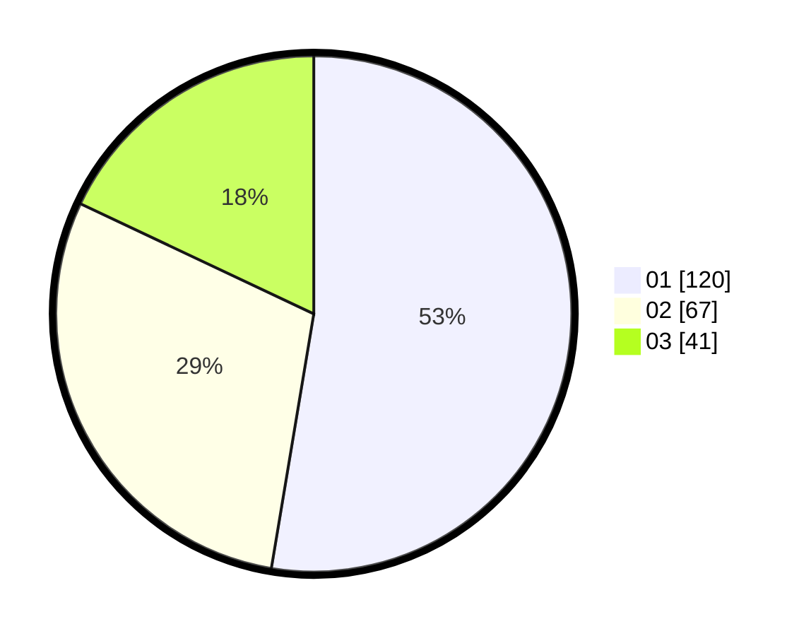

# Hasil

Hasil perolehan suara paslon dapat dilihat pada file paslon-01.txt, paslon-02.txt, dan paslon-03.txt.

Jika tidak ada, artinya data tersebut belum ada pada SIREKAP.

## Perolehan Suara

 * Paslon 01: **120**.
 * Paslon 02: **67**.
 * Paslon 03: **41**.

## Foto C Plano

https://sirekap-obj-formc.kpu.go.id/acb2/pemilu/ppwp/31/73/08/10/02/3173081002127-20240214-190905--04d2369f-4214-453d-9daa-13bcd7dac8a6.jpg

https://sirekap-obj-formc.kpu.go.id/acb2/pemilu/ppwp/31/73/08/10/02/3173081002127-20240214-224935--acb0e731-92c6-4341-9587-2128398c51c8.jpg

https://sirekap-obj-formc.kpu.go.id/acb2/pemilu/ppwp/31/73/08/10/02/3173081002127-20240214-225143--7bdd130c-9a19-4394-baec-5668bbff88bf.jpg

## DATA PEMILIH TETAP

Jumlah pemilih dalam DPT: **298**.
 * L: **137**.
 * P: **161**.

## DATA PENGGUNA HAK PILIH

Jumlah pengguna hak pilih dalam DPT: **233**.
 * L: **105**.
 * P: **128**.

Jumlah pengguna hak pilih dalam DPTb: **0**.
 * L: **0**.
 * P: **0**.

Jumlah pengguna hak pilih dalam DPK: **0**.
 * L: **0**.
 * P: **0**.

Jumlah pengguna hak pilih: **233**.
 * L: **105**.
 * P: **128**.

## JUMLAH SUARA SAH DAN TIDAK SAH

JUMLAH SELURUH SUARA SAH: **228**.

JUMLAH SUARA TIDAK SAH: **5**.

JUMLAH SELURUH SUARA SAH DAN SUARA TIDAK SAH: **233**.
