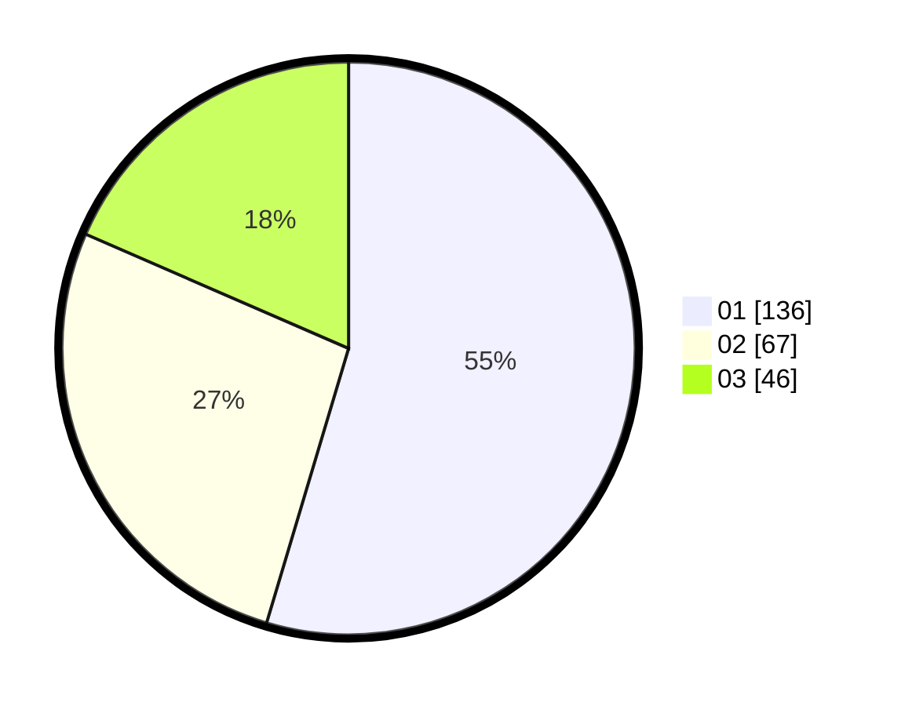

# Hasil

Hasil perolehan suara paslon dapat dilihat pada file paslon-01.txt, paslon-02.txt, dan paslon-03.txt.

Jika tidak ada, artinya data tersebut belum ada pada SIREKAP.

## Perolehan Suara

 * Paslon 01: **136**.
 * Paslon 02: **67**.
 * Paslon 03: **46**.

## Foto C Plano

https://sirekap-obj-formc.kpu.go.id/1317/pemilu/ppwp/31/73/08/10/02/3173081002129-20240214-225219--528ceed2-efd6-4bb6-88fd-63dc65e4d7cf.jpg

https://sirekap-obj-formc.kpu.go.id/1317/pemilu/ppwp/31/73/08/10/02/3173081002129-20240214-225133--99c49097-9531-4c32-8944-9d8042a63697.jpg

https://sirekap-obj-formc.kpu.go.id/1317/pemilu/ppwp/31/73/08/10/02/3173081002129-20240214-225051--d106c74c-2b8d-4b56-bb81-766c720cc465.jpg

## DATA PEMILIH TETAP

Jumlah pemilih dalam DPT: **295**.
 * L: **147**.
 * P: **148**.

## DATA PENGGUNA HAK PILIH

Jumlah pengguna hak pilih dalam DPT: **238**.
 * L: **110**.
 * P: **128**.

Jumlah pengguna hak pilih dalam DPTb: **8**.
 * L: **4**.
 * P: **4**.

Jumlah pengguna hak pilih dalam DPK: **3**.
 * L: **1**.
 * P: **2**.

Jumlah pengguna hak pilih: **249**.
 * L: **115**.
 * P: **134**.

## JUMLAH SUARA SAH DAN TIDAK SAH

JUMLAH SELURUH SUARA SAH: **249**.

JUMLAH SUARA TIDAK SAH: **0**.

JUMLAH SELURUH SUARA SAH DAN SUARA TIDAK SAH: **249**.
