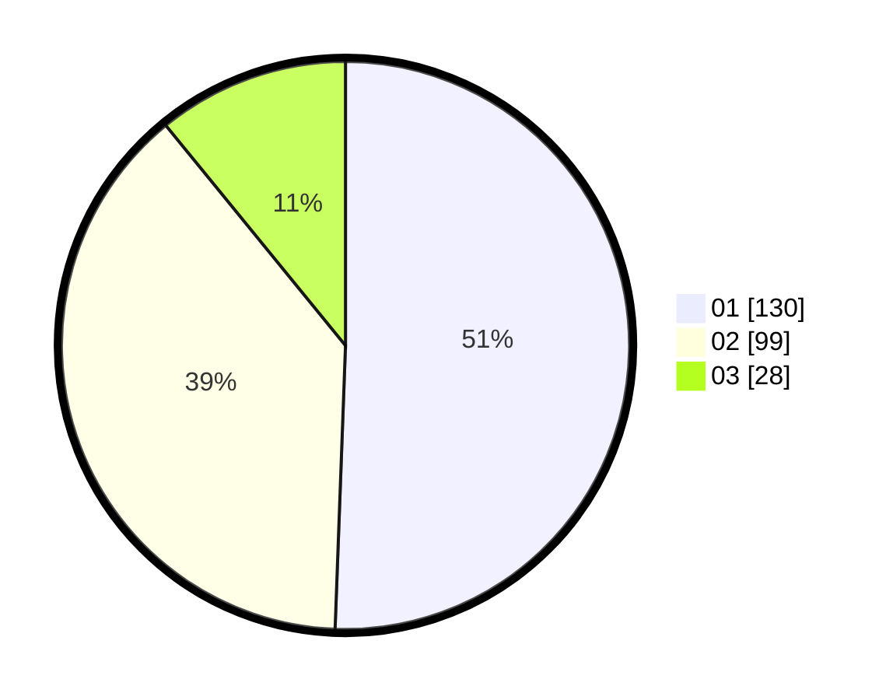

# Hasil

Hasil perolehan suara paslon dapat dilihat pada file paslon-01.txt, paslon-02.txt, dan paslon-03.txt.

Jika tidak ada, artinya data tersebut belum ada pada SIREKAP.

## Perolehan Suara

 * Paslon 01: **130**.
 * Paslon 02: **99**.
 * Paslon 03: **28**.

## Foto C Plano

https://sirekap-obj-formc.kpu.go.id/8d28/pemilu/ppwp/31/73/08/10/02/3173081002131-20240214-231024--5c7c544c-e55c-439a-9a80-9463be3fcef0.jpg

https://sirekap-obj-formc.kpu.go.id/8d28/pemilu/ppwp/31/73/08/10/02/3173081002131-20240214-194057--6d65400e-e75e-464b-bdd3-15fdb7a02ba0.jpg

https://sirekap-obj-formc.kpu.go.id/8d28/pemilu/ppwp/31/73/08/10/02/3173081002131-20240214-231412--09bbe912-5c71-4dd4-a9a7-d73ee74f156c.jpg

## DATA PEMILIH TETAP

Jumlah pemilih dalam DPT: **297**.
 * L: **158**.
 * P: **139**.

## DATA PENGGUNA HAK PILIH

Jumlah pengguna hak pilih dalam DPT: **252**.
 * L: **131**.
 * P: **121**.

Jumlah pengguna hak pilih dalam DPTb: **2**.
 * L: **2**.
 * P: **0**.

Jumlah pengguna hak pilih dalam DPK: **4**.
 * L: **3**.
 * P: **1**.

Jumlah pengguna hak pilih: **258**.
 * L: **136**.
 * P: **122**.

## JUMLAH SUARA SAH DAN TIDAK SAH

JUMLAH SELURUH SUARA SAH: **257**.

JUMLAH SUARA TIDAK SAH: **1**.

JUMLAH SELURUH SUARA SAH DAN SUARA TIDAK SAH: **258**.
