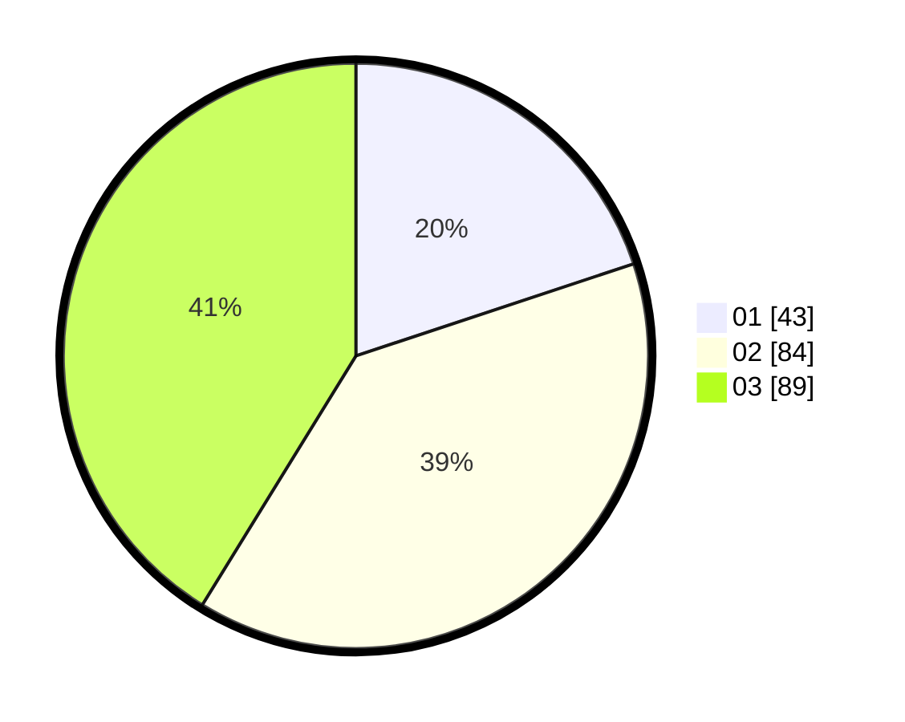

# Hasil

Hasil perolehan suara paslon dapat dilihat pada file paslon-01.txt, paslon-02.txt, dan paslon-03.txt.

Jika tidak ada, artinya data tersebut belum ada pada SIREKAP.

## Perolehan Suara

 * Paslon 01: **43**.
 * Paslon 02: **84**.
 * Paslon 03: **89**.

## Foto C Plano

https://sirekap-obj-formc.kpu.go.id/70f0/pemilu/ppwp/31/73/08/10/02/3173081002134-20240215-075713--cdefd9f6-e4a4-458e-8184-0b7505edf589.jpg

https://sirekap-obj-formc.kpu.go.id/70f0/pemilu/ppwp/31/73/08/10/02/3173081002134-20240215-075718--c418608d-5422-4c5c-931a-b5154786f84e.jpg

https://sirekap-obj-formc.kpu.go.id/70f0/pemilu/ppwp/31/73/08/10/02/3173081002134-20240215-075724--d6f17f3f-1f0f-49ee-be45-2c694146f84d.jpg
