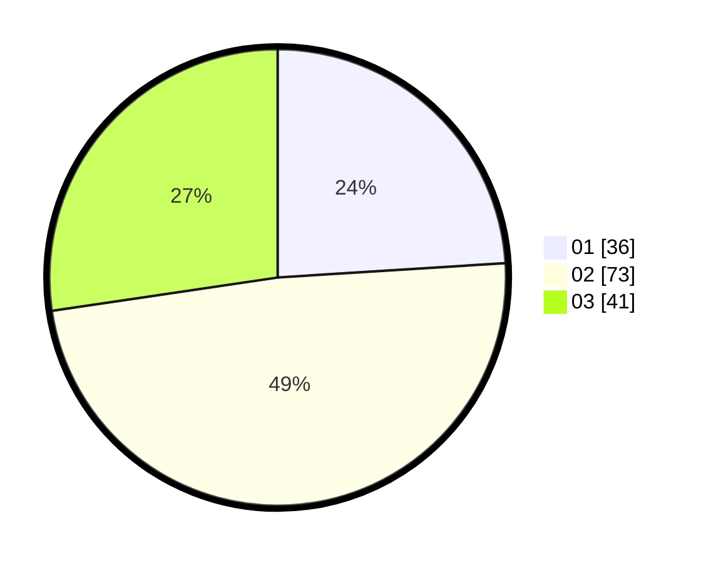

# Hasil

Hasil perolehan suara paslon dapat dilihat pada file paslon-01.txt, paslon-02.txt, dan paslon-03.txt.

Jika tidak ada, artinya data tersebut belum ada pada SIREKAP.

## Perolehan Suara

 * Paslon 01: **36**.
 * Paslon 02: **73**.
 * Paslon 03: **41**.

## Foto C Plano

https://sirekap-obj-formc.kpu.go.id/5bcd/pemilu/ppwp/31/73/08/10/02/3173081002135-20240216-135619--996300cf-5606-4b73-af1a-9edb9eedfbe9.jpg

https://sirekap-obj-formc.kpu.go.id/5bcd/pemilu/ppwp/31/73/08/10/02/3173081002135-20240214-155715--57ed9acf-17e4-4d11-969d-3aa3acdadee1.jpg

https://sirekap-obj-formc.kpu.go.id/5bcd/pemilu/ppwp/31/73/08/10/02/3173081002135-20240216-135620--28012961-f34c-4217-8899-70a75b1b927b.jpg

## DATA PEMILIH TETAP

Jumlah pemilih dalam DPT: **179**.
 * L: **84**.
 * P: **95**.

## DATA PENGGUNA HAK PILIH

Jumlah pengguna hak pilih dalam DPT: **141**.
 * L: **68**.
 * P: **73**.

Jumlah pengguna hak pilih dalam DPTb: **8**.
 * L: **0**.
 * P: **8**.

Jumlah pengguna hak pilih dalam DPK: **4**.
 * L: **3**.
 * P: **1**.

Jumlah pengguna hak pilih: **153**.
 * L: **79**.
 * P: **74**.

## JUMLAH SUARA SAH DAN TIDAK SAH

JUMLAH SELURUH SUARA SAH: **150**.

JUMLAH SUARA TIDAK SAH: **3**.

JUMLAH SELURUH SUARA SAH DAN SUARA TIDAK SAH: **153**.
