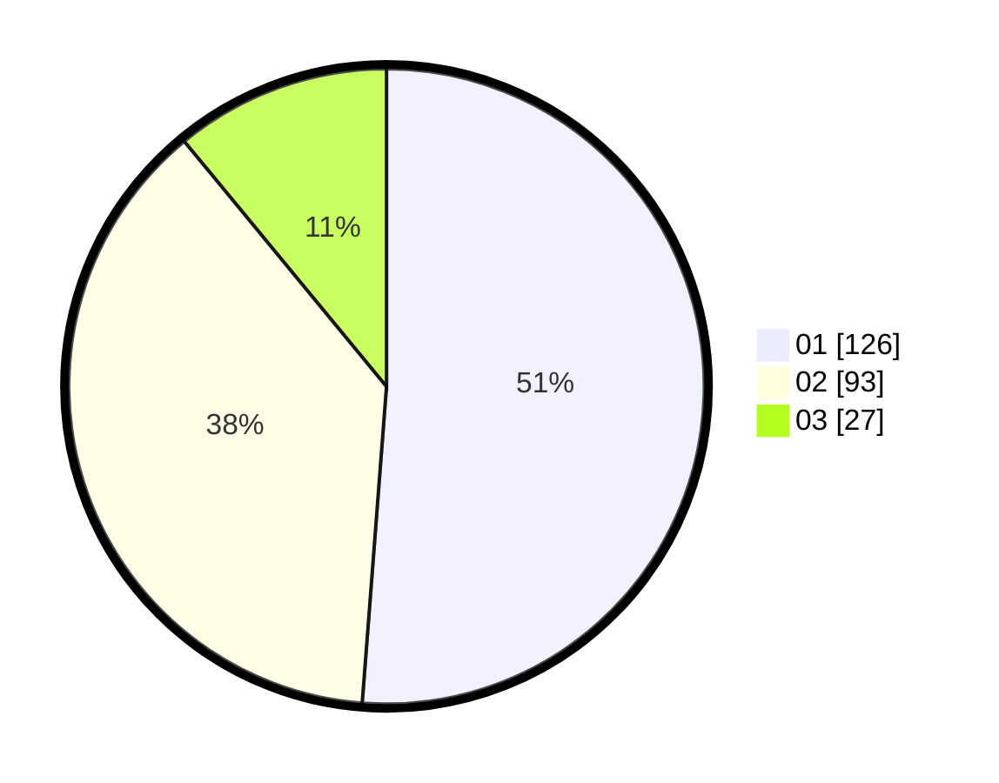

# Hasil

Hasil perolehan suara paslon dapat dilihat pada file paslon-01.txt, paslon-02.txt, dan paslon-03.txt.

Jika tidak ada, artinya data tersebut belum ada pada SIREKAP.

## Perolehan Suara

 * Paslon 01: **126**.
 * Paslon 02: **93**.
 * Paslon 03: **27**.

## Foto C Plano

https://sirekap-obj-formc.kpu.go.id/ad21/pemilu/ppwp/31/73/08/10/02/3173081002137-20240216-065453--8f2eba16-e763-46e3-8338-a20f6a60ea1e.jpg

https://sirekap-obj-formc.kpu.go.id/ad21/pemilu/ppwp/31/73/08/10/02/3173081002137-20240216-065508--60bb7717-b84d-4b71-957f-ac5f1053066f.jpg

https://sirekap-obj-formc.kpu.go.id/ad21/pemilu/ppwp/31/73/08/10/02/3173081002137-20240216-065502--64a2886a-9754-4008-92c7-2b664799b6a8.jpg

## DATA PEMILIH TETAP

Jumlah pemilih dalam DPT: **295**.
 * L: **143**.
 * P: **152**.

## DATA PENGGUNA HAK PILIH

Jumlah pengguna hak pilih dalam DPT: **248**.
 * L: **121**.
 * P: **127**.

Jumlah pengguna hak pilih dalam DPTb: **0**.
 * L: **0**.
 * P: **0**.

Jumlah pengguna hak pilih dalam DPK: **2**.
 * L: **1**.
 * P: **1**.

Jumlah pengguna hak pilih: **250**.
 * L: **122**.
 * P: **128**.

## JUMLAH SUARA SAH DAN TIDAK SAH

JUMLAH SELURUH SUARA SAH: **246**.

JUMLAH SUARA TIDAK SAH: **4**.

JUMLAH SELURUH SUARA SAH DAN SUARA TIDAK SAH: **250**.
