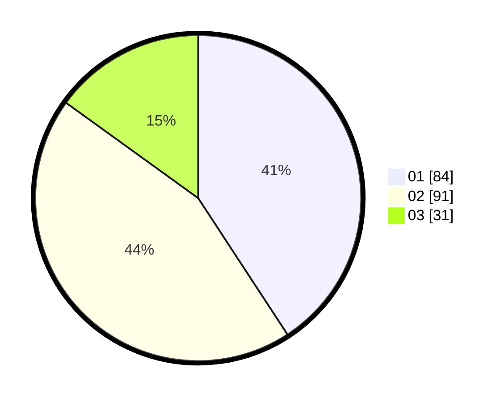

# Hasil

Hasil perolehan suara paslon dapat dilihat pada file paslon-01.txt, paslon-02.txt, dan paslon-03.txt.

Jika tidak ada, artinya data tersebut belum ada pada SIREKAP.

## Perolehan Suara

 * Paslon 01: **84**.
 * Paslon 02: **91**.
 * Paslon 03: **31**.

## Foto C Plano

https://sirekap-obj-formc.kpu.go.id/4dea/pemilu/ppwp/31/73/08/10/02/3173081002147-20240214-224653--b66fcb0e-b820-4764-a30a-2d70f71bc9df.jpg

https://sirekap-obj-formc.kpu.go.id/4dea/pemilu/ppwp/31/73/08/10/02/3173081002147-20240214-224531--07551485-c9a6-4a12-a471-141562674f41.jpg

https://sirekap-obj-formc.kpu.go.id/4dea/pemilu/ppwp/31/73/08/10/02/3173081002147-20240214-224348--8fce3309-e6c0-4950-bd34-217a11b9905b.jpg
