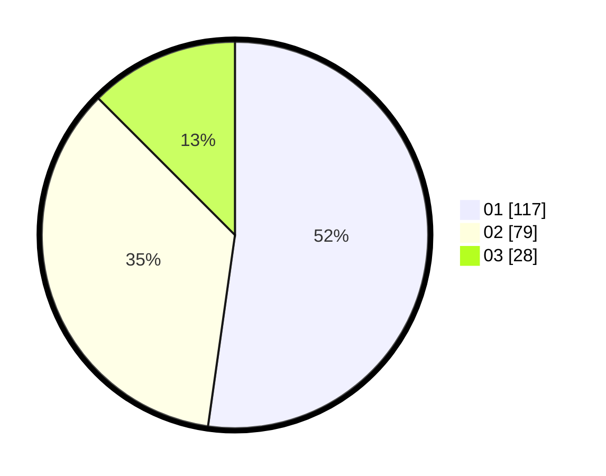

# Hasil

Hasil perolehan suara paslon dapat dilihat pada file paslon-01.txt, paslon-02.txt, dan paslon-03.txt.

Jika tidak ada, artinya data tersebut belum ada pada SIREKAP.

## Perolehan Suara

 * Paslon 01: **117**.
 * Paslon 02: **79**.
 * Paslon 03: **28**.

## Foto C Plano

https://sirekap-obj-formc.kpu.go.id/465f/pemilu/ppwp/31/73/08/10/02/3173081002148-20240216-121636--8ef40feb-d10a-4b46-b1f3-390d7016cdba.jpg

https://sirekap-obj-formc.kpu.go.id/465f/pemilu/ppwp/31/73/08/10/02/3173081002148-20240216-121642--b77f5a93-df29-4b7d-a991-e0177a8940de.jpg

https://sirekap-obj-formc.kpu.go.id/465f/pemilu/ppwp/31/73/08/10/02/3173081002148-20240216-121639--078b82f3-4f9d-4bf2-90e1-19ce1007a846.jpg

## DATA PEMILIH TETAP

Jumlah pemilih dalam DPT: **269**.
 * L: **135**.
 * P: **134**.

## DATA PENGGUNA HAK PILIH

Jumlah pengguna hak pilih dalam DPT: **220**.
 * L: **114**.
 * P: **106**.

Jumlah pengguna hak pilih dalam DPTb: **1**.
 * L: **0**.
 * P: **1**.

Jumlah pengguna hak pilih dalam DPK: **3**.
 * L: **2**.
 * P: **1**.

Jumlah pengguna hak pilih: **224**.
 * L: **116**.
 * P: **108**.

## JUMLAH SUARA SAH DAN TIDAK SAH

JUMLAH SELURUH SUARA SAH: **224**.

JUMLAH SUARA TIDAK SAH: **0**.

JUMLAH SELURUH SUARA SAH DAN SUARA TIDAK SAH: **224**.
