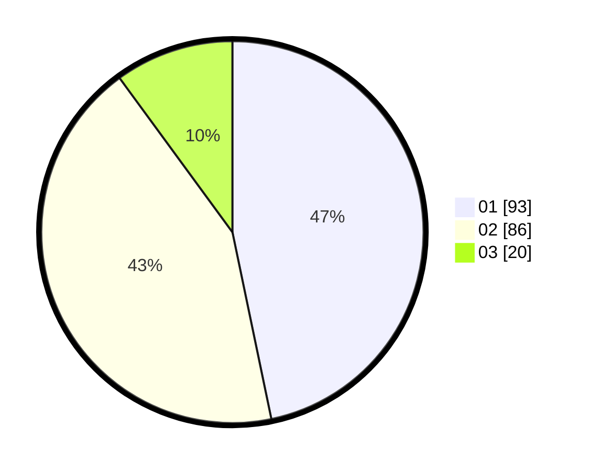

# Hasil

Hasil perolehan suara paslon dapat dilihat pada file paslon-01.txt, paslon-02.txt, dan paslon-03.txt.

Jika tidak ada, artinya data tersebut belum ada pada SIREKAP.

## Perolehan Suara

 * Paslon 01: **93**.
 * Paslon 02: **86**.
 * Paslon 03: **20**.

## Foto C Plano

https://sirekap-obj-formc.kpu.go.id/c28c/pemilu/ppwp/31/73/08/10/02/3173081002149-20240215-213819--7f6457c2-5e7c-481a-81d0-8c745e5aa5f7.jpg

https://sirekap-obj-formc.kpu.go.id/c28c/pemilu/ppwp/31/73/08/10/02/3173081002149-20240215-213821--a84fe62e-a6b0-49ee-bc09-2a61d23bed07.jpg

https://sirekap-obj-formc.kpu.go.id/c28c/pemilu/ppwp/31/73/08/10/02/3173081002149-20240215-213820--0530aea4-1a69-4710-8e2a-8a31c68c3ffc.jpg

## DATA PEMILIH TETAP

Jumlah pemilih dalam DPT: **270**.
 * L: **133**.
 * P: **137**.

## DATA PENGGUNA HAK PILIH

Jumlah pengguna hak pilih dalam DPT: **198**.
 * L: **95**.
 * P: **103**.

Jumlah pengguna hak pilih dalam DPTb: **1**.
 * L: **1**.
 * P: **0**.

Jumlah pengguna hak pilih dalam DPK: **0**.
 * L: **0**.
 * P: **0**.

Jumlah pengguna hak pilih: **199**.
 * L: **96**.
 * P: **103**.

## JUMLAH SUARA SAH DAN TIDAK SAH

JUMLAH SELURUH SUARA SAH: **199**.

JUMLAH SUARA TIDAK SAH: **0**.

JUMLAH SELURUH SUARA SAH DAN SUARA TIDAK SAH: **199**.
