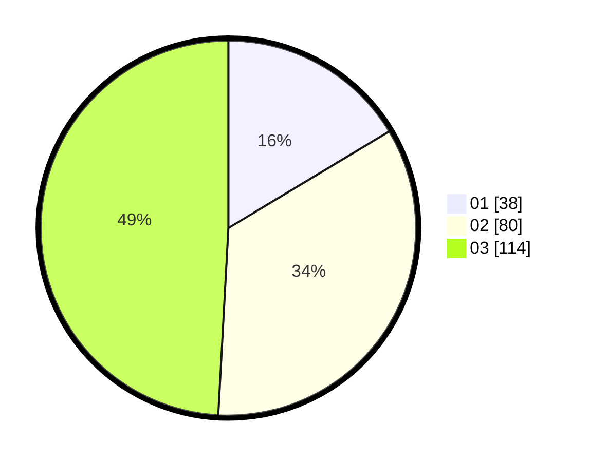

# Hasil

Hasil perolehan suara paslon dapat dilihat pada file paslon-01.txt, paslon-02.txt, dan paslon-03.txt.

Jika tidak ada, artinya data tersebut belum ada pada SIREKAP.

## Perolehan Suara

 * Paslon 01: **38**.
 * Paslon 02: **80**.
 * Paslon 03: **114**.

## Foto C Plano

https://sirekap-obj-formc.kpu.go.id/2f1a/pemilu/ppwp/31/73/08/10/02/3173081002151-20240214-200104--88b23420-7140-4c7a-9af1-07213a7e2b42.jpg

https://sirekap-obj-formc.kpu.go.id/2f1a/pemilu/ppwp/31/73/08/10/02/3173081002151-20240214-200225--df4aa5dc-f15d-40d9-8913-2f85954ad29a.jpg

https://sirekap-obj-formc.kpu.go.id/2f1a/pemilu/ppwp/31/73/08/10/02/3173081002151-20240214-200332--573bf690-2df6-4574-bf2d-ca684bc7323c.jpg

## DATA PEMILIH TETAP

Jumlah pemilih dalam DPT: **268**.
 * L: **124**.
 * P: **144**.

## DATA PENGGUNA HAK PILIH

Jumlah pengguna hak pilih dalam DPT: **209**.
 * L: **96**.
 * P: **113**.

Jumlah pengguna hak pilih dalam DPTb: **16**.
 * L: **8**.
 * P: **8**.

Jumlah pengguna hak pilih dalam DPK: **11**.
 * L: **6**.
 * P: **5**.

Jumlah pengguna hak pilih: **236**.
 * L: **110**.
 * P: **126**.

## JUMLAH SUARA SAH DAN TIDAK SAH

JUMLAH SELURUH SUARA SAH: **232**.

JUMLAH SUARA TIDAK SAH: **4**.

JUMLAH SELURUH SUARA SAH DAN SUARA TIDAK SAH: **236**.
