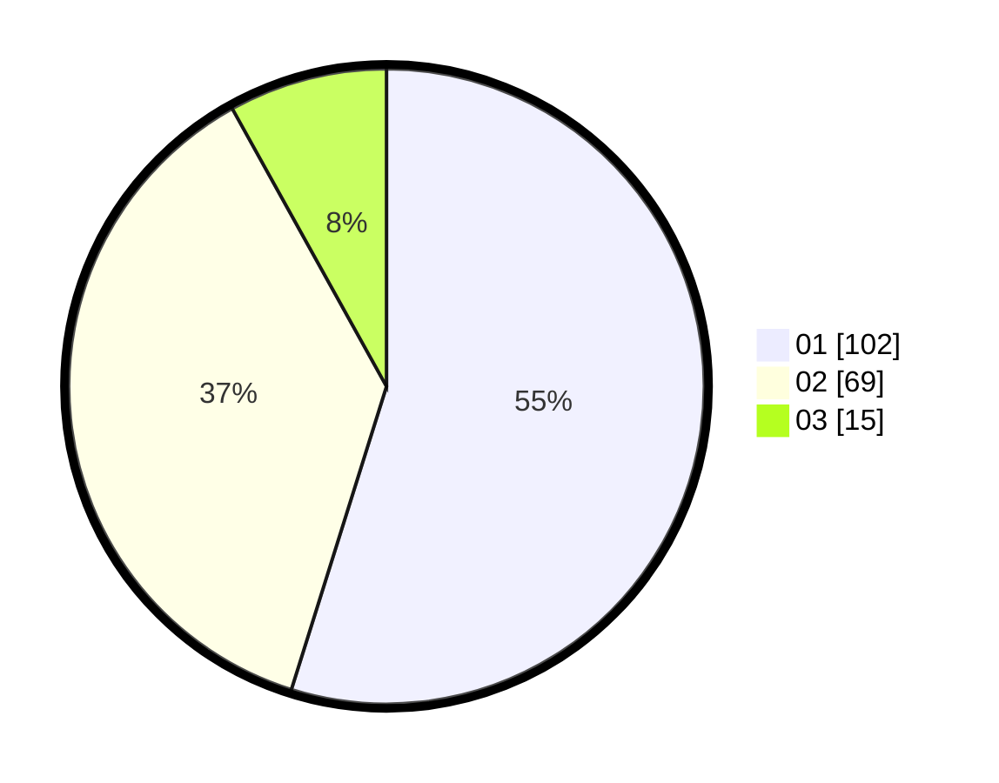

# Hasil

Hasil perolehan suara paslon dapat dilihat pada file paslon-01.txt, paslon-02.txt, dan paslon-03.txt.

Jika tidak ada, artinya data tersebut belum ada pada SIREKAP.

## Perolehan Suara

 * Paslon 01: **102**.
 * Paslon 02: **69**.
 * Paslon 03: **15**.

## Foto C Plano

https://sirekap-obj-formc.kpu.go.id/4cce/pemilu/ppwp/31/73/08/10/03/3173081003001-20240214-185548--1d43bd47-1739-4454-9f0b-ba1493361142.jpg

https://sirekap-obj-formc.kpu.go.id/4cce/pemilu/ppwp/31/73/08/10/03/3173081003001-20240214-190137--9a680607-2107-4118-9fae-317af769209b.jpg

https://sirekap-obj-formc.kpu.go.id/4cce/pemilu/ppwp/31/73/08/10/03/3173081003001-20240214-190021--b9e94ef2-f91b-44c6-8cf7-c4c68577e0b7.jpg

## DATA PEMILIH TETAP

Jumlah pemilih dalam DPT: **228**.
 * L: **109**.
 * P: **119**.

## DATA PENGGUNA HAK PILIH

Jumlah pengguna hak pilih dalam DPT: **190**.
 * L: **95**.
 * P: **95**.

Jumlah pengguna hak pilih dalam DPTb: **0**.
 * L: **0**.
 * P: **0**.

Jumlah pengguna hak pilih dalam DPK: **0**.
 * L: **0**.
 * P: **0**.

Jumlah pengguna hak pilih: **190**.
 * L: **95**.
 * P: **95**.

## JUMLAH SUARA SAH DAN TIDAK SAH

JUMLAH SELURUH SUARA SAH: **186**.

JUMLAH SUARA TIDAK SAH: **4**.

JUMLAH SELURUH SUARA SAH DAN SUARA TIDAK SAH: **190**.
