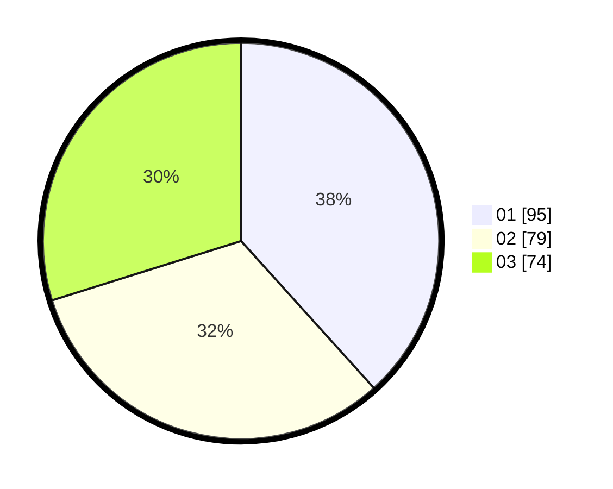

# Hasil

Hasil perolehan suara paslon dapat dilihat pada file paslon-01.txt, paslon-02.txt, dan paslon-03.txt.

Jika tidak ada, artinya data tersebut belum ada pada SIREKAP.

## Perolehan Suara

 * Paslon 01: **95**.
 * Paslon 02: **79**.
 * Paslon 03: **74**.

## Foto C Plano

https://sirekap-obj-formc.kpu.go.id/0953/pemilu/ppwp/31/73/08/10/03/3173081003002-20240214-201356--d8c38364-e507-4926-8d99-b58b47d5303f.jpg

https://sirekap-obj-formc.kpu.go.id/0953/pemilu/ppwp/31/73/08/10/03/3173081003002-20240214-201544--d3427011-a920-4618-9c98-982c55416749.jpg

https://sirekap-obj-formc.kpu.go.id/0953/pemilu/ppwp/31/73/08/10/03/3173081003002-20240214-201639--57c0ee47-0b27-406e-8ee0-266b20d9e64f.jpg

## DATA PEMILIH TETAP

Jumlah pemilih dalam DPT: **226**.
 * L: **103**.
 * P: **123**.

## DATA PENGGUNA HAK PILIH

Jumlah pengguna hak pilih dalam DPT: **194**.
 * L: **88**.
 * P: **106**.

Jumlah pengguna hak pilih dalam DPTb: **1**.
 * L: **1**.
 * P: **0**.

Jumlah pengguna hak pilih dalam DPK: **0**.
 * L: **0**.
 * P: **0**.

Jumlah pengguna hak pilih: **195**.
 * L: **89**.
 * P: **106**.

## JUMLAH SUARA SAH DAN TIDAK SAH

JUMLAH SELURUH SUARA SAH: **194**.

JUMLAH SUARA TIDAK SAH: **1**.

JUMLAH SELURUH SUARA SAH DAN SUARA TIDAK SAH: **195**.
