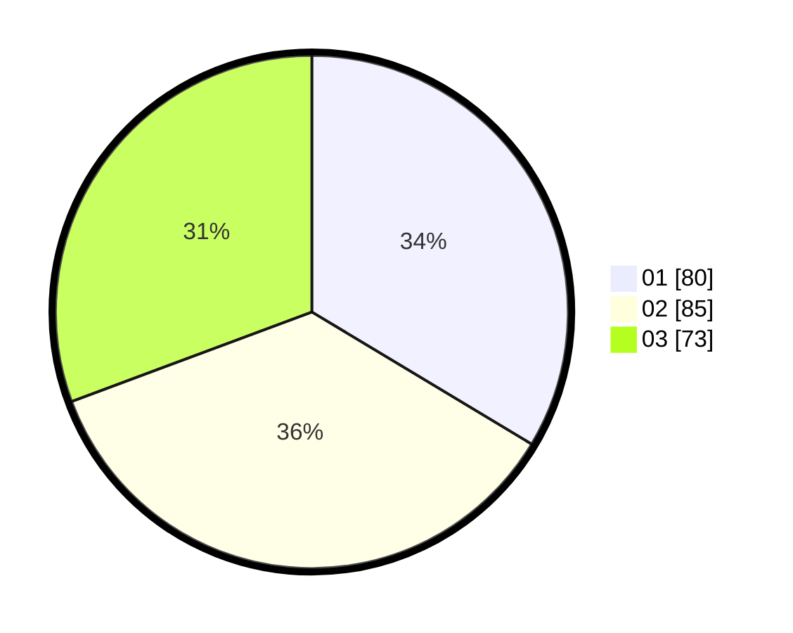

# Hasil

Hasil perolehan suara paslon dapat dilihat pada file paslon-01.txt, paslon-02.txt, dan paslon-03.txt.

Jika tidak ada, artinya data tersebut belum ada pada SIREKAP.

## Perolehan Suara

 * Paslon 01: **80**.
 * Paslon 02: **85**.
 * Paslon 03: **73**.

## Foto C Plano

https://sirekap-obj-formc.kpu.go.id/7d23/pemilu/ppwp/31/73/08/10/03/3173081003011-20240217-083102--96c45bb8-f0a7-4b91-afc6-9ba4fdfd944a.jpg

https://sirekap-obj-formc.kpu.go.id/7d23/pemilu/ppwp/31/73/08/10/03/3173081003011-20240217-083753--e8241c3d-9de0-45c3-ba66-ceff8d7a3abe.jpg

https://sirekap-obj-formc.kpu.go.id/7d23/pemilu/ppwp/31/73/08/10/03/3173081003011-20240217-090250--1a62b47d-9ff9-456b-9a43-2e0847bb6b3b.jpg
