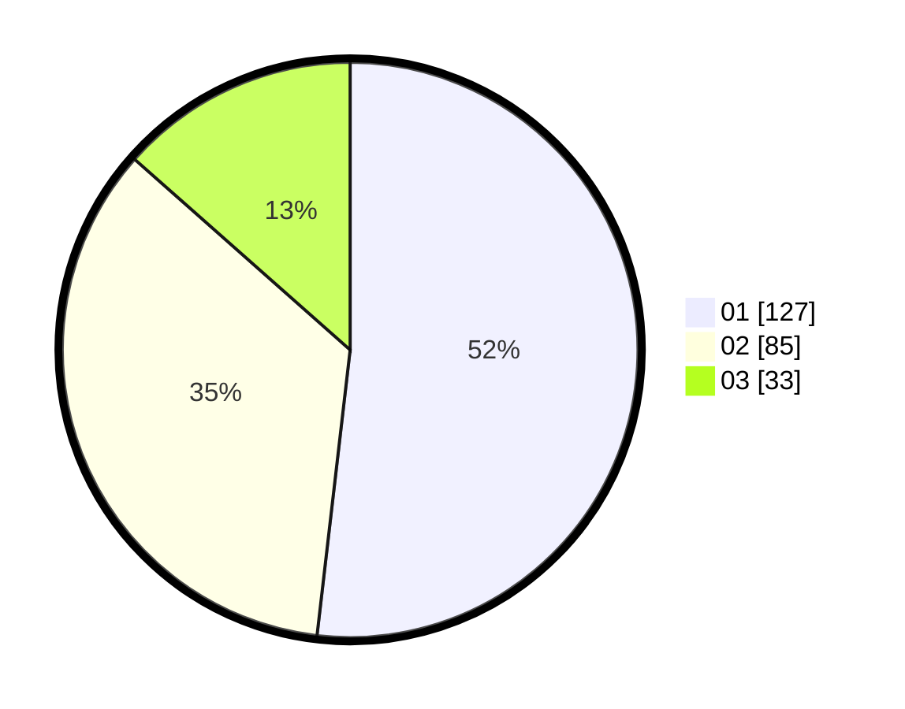

# Hasil

Hasil perolehan suara paslon dapat dilihat pada file paslon-01.txt, paslon-02.txt, dan paslon-03.txt.

Jika tidak ada, artinya data tersebut belum ada pada SIREKAP.

## Perolehan Suara

 * Paslon 01: **127**.
 * Paslon 02: **85**.
 * Paslon 03: **33**.

## Foto C Plano

https://sirekap-obj-formc.kpu.go.id/de24/pemilu/ppwp/31/73/08/10/03/3173081003014-20240214-201220--1b84fd38-281f-43e6-abff-3bfde8486519.jpg

https://sirekap-obj-formc.kpu.go.id/de24/pemilu/ppwp/31/73/08/10/03/3173081003014-20240214-201238--0c120cb4-2f7a-4247-a94e-d370be972236.jpg

https://sirekap-obj-formc.kpu.go.id/de24/pemilu/ppwp/31/73/08/10/03/3173081003014-20240214-201243--ef6086a6-3cc9-4f48-853f-fbde02d04d9f.jpg

## DATA PEMILIH TETAP

Jumlah pemilih dalam DPT: **291**.
 * L: **138**.
 * P: **153**.

## DATA PENGGUNA HAK PILIH

Jumlah pengguna hak pilih dalam DPT: **245**.
 * L: **118**.
 * P: **127**.

Jumlah pengguna hak pilih dalam DPTb: **3**.
 * L: **2**.
 * P: **1**.

Jumlah pengguna hak pilih dalam DPK: **0**.
 * L: **0**.
 * P: **0**.

Jumlah pengguna hak pilih: **248**.
 * L: **120**.
 * P: **128**.

## JUMLAH SUARA SAH DAN TIDAK SAH

JUMLAH SELURUH SUARA SAH: **245**.

JUMLAH SUARA TIDAK SAH: **3**.

JUMLAH SELURUH SUARA SAH DAN SUARA TIDAK SAH: **248**.
