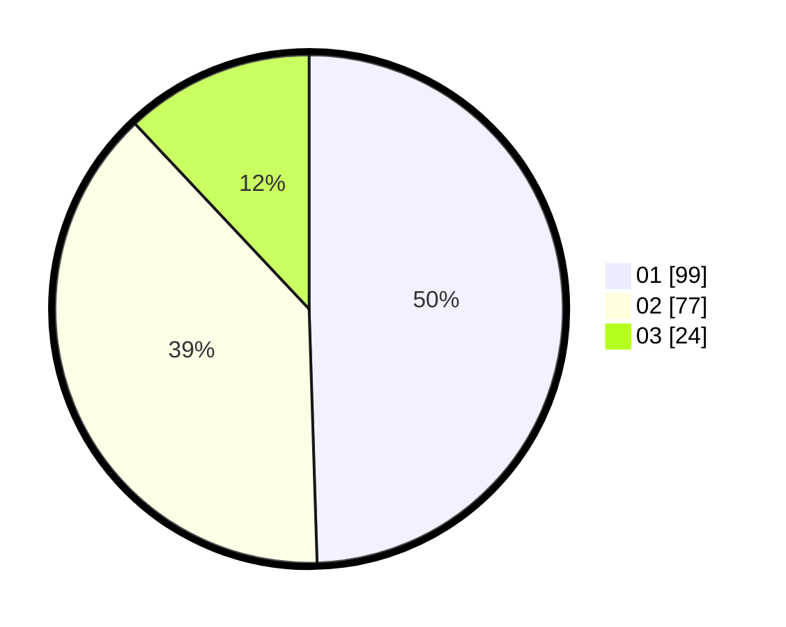

# Hasil

Hasil perolehan suara paslon dapat dilihat pada file paslon-01.txt, paslon-02.txt, dan paslon-03.txt.

Jika tidak ada, artinya data tersebut belum ada pada SIREKAP.

## Perolehan Suara

 * Paslon 01: **99**.
 * Paslon 02: **77**.
 * Paslon 03: **24**.

## Foto C Plano

https://sirekap-obj-formc.kpu.go.id/d916/pemilu/ppwp/31/73/08/10/03/3173081003016-20240214-224811--342989e4-0914-4b79-9db0-83ee7ea4294c.jpg

https://sirekap-obj-formc.kpu.go.id/d916/pemilu/ppwp/31/73/08/10/03/3173081003016-20240214-224925--4558adf2-84d9-4da6-a73e-5f05bd072480.jpg

https://sirekap-obj-formc.kpu.go.id/d916/pemilu/ppwp/31/73/08/10/03/3173081003016-20240214-225108--8703bebc-3a8a-4ab5-98a0-eb7ae5484e9d.jpg
