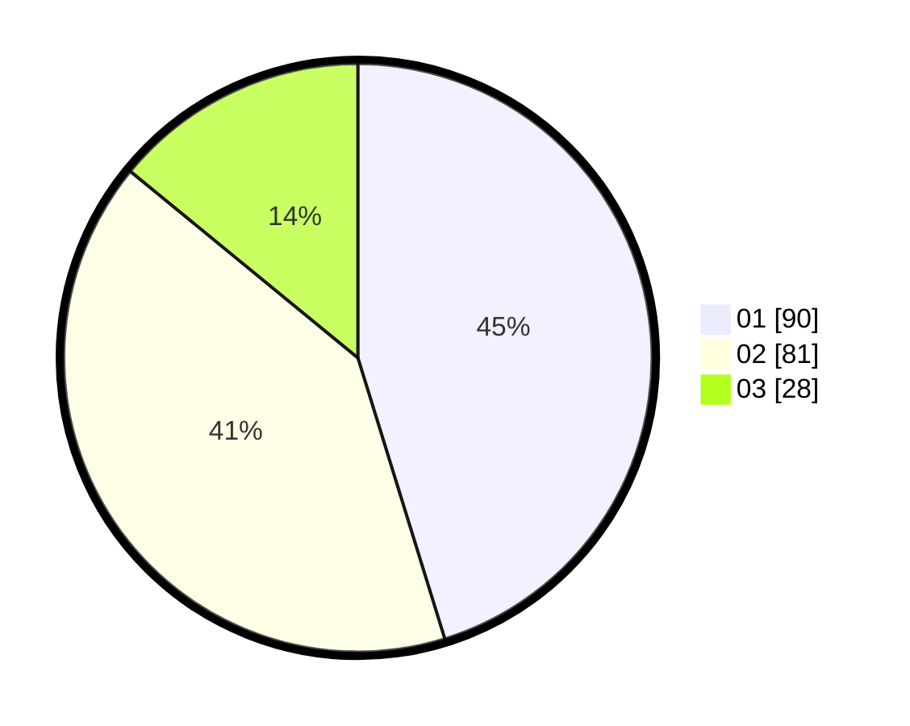

# Hasil

Hasil perolehan suara paslon dapat dilihat pada file paslon-01.txt, paslon-02.txt, dan paslon-03.txt.

Jika tidak ada, artinya data tersebut belum ada pada SIREKAP.

## Perolehan Suara

 * Paslon 01: **90**.
 * Paslon 02: **81**.
 * Paslon 03: **28**.

## Foto C Plano

https://sirekap-obj-formc.kpu.go.id/f631/pemilu/ppwp/31/73/08/10/03/3173081003017-20240214-194432--b9a72d92-c0f4-4607-8aaf-fe001ecb253a.jpg

https://sirekap-obj-formc.kpu.go.id/f631/pemilu/ppwp/31/73/08/10/03/3173081003017-20240214-190653--b3b1e7b3-afbd-439f-9386-cccbf92d3cdc.jpg

https://sirekap-obj-formc.kpu.go.id/f631/pemilu/ppwp/31/73/08/10/03/3173081003017-20240214-190712--f61d36ba-c827-49e3-b519-638c820402f9.jpg

## DATA PEMILIH TETAP

Jumlah pemilih dalam DPT: **261**.
 * L: **127**.
 * P: **134**.

## DATA PENGGUNA HAK PILIH

Jumlah pengguna hak pilih dalam DPT: **198**.
 * L: **97**.
 * P: **101**.

Jumlah pengguna hak pilih dalam DPTb: **0**.
 * L: **0**.
 * P: **0**.

Jumlah pengguna hak pilih dalam DPK: **2**.
 * L: **1**.
 * P: **1**.

Jumlah pengguna hak pilih: **200**.
 * L: **98**.
 * P: **102**.

## JUMLAH SUARA SAH DAN TIDAK SAH

JUMLAH SELURUH SUARA SAH: **199**.

JUMLAH SUARA TIDAK SAH: **1**.

JUMLAH SELURUH SUARA SAH DAN SUARA TIDAK SAH: **200**.
