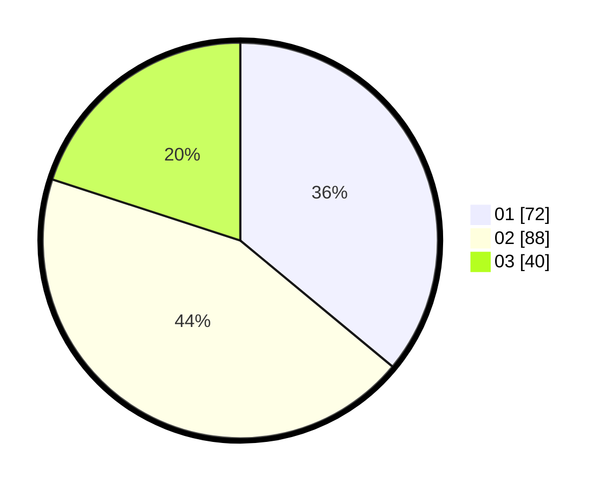

# Hasil

Hasil perolehan suara paslon dapat dilihat pada file paslon-01.txt, paslon-02.txt, dan paslon-03.txt.

Jika tidak ada, artinya data tersebut belum ada pada SIREKAP.

## Perolehan Suara

 * Paslon 01: **72**.
 * Paslon 02: **88**.
 * Paslon 03: **40**.

## Foto C Plano

https://sirekap-obj-formc.kpu.go.id/3b6b/pemilu/ppwp/31/73/08/10/03/3173081003019-20240214-224748--cf0ed68b-3f29-423b-a905-9c33fb405325.jpg

https://sirekap-obj-formc.kpu.go.id/3b6b/pemilu/ppwp/31/73/08/10/03/3173081003019-20240214-215958--1ef15825-0979-49f2-a0aa-99140dd3dad8.jpg

https://sirekap-obj-formc.kpu.go.id/3b6b/pemilu/ppwp/31/73/08/10/03/3173081003019-20240214-220107--d6d67c7b-8f4c-4ef2-a0cb-36f96bf50f57.jpg
