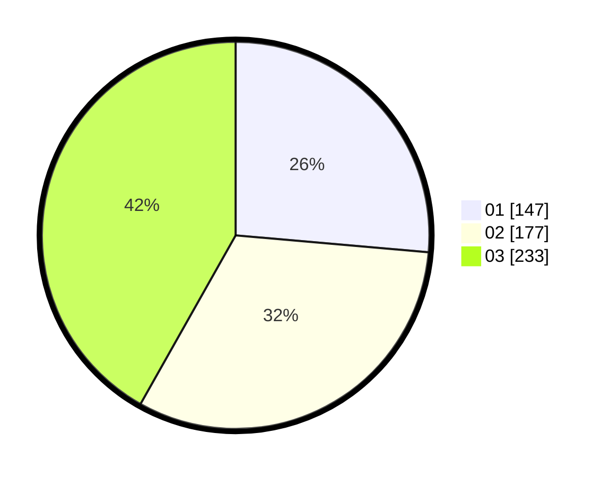

# Hasil

Hasil perolehan suara paslon dapat dilihat pada file paslon-01.txt, paslon-02.txt, dan paslon-03.txt.

Jika tidak ada, artinya data tersebut belum ada pada SIREKAP.

## Perolehan Suara

 * Paslon 01: **147**.
 * Paslon 02: **177**.
 * Paslon 03: **233**.

## Foto C Plano

https://sirekap-obj-formc.kpu.go.id/5bd0/pemilu/ppwp/31/73/08/10/03/3173081003023-20240215-012910--2bacf25a-990c-4ef4-939a-44aaa7864a98.jpg

https://sirekap-obj-formc.kpu.go.id/5bd0/pemilu/ppwp/31/73/08/10/03/3173081003023-20240215-013051--21d39f20-d4bc-4dc6-82cb-309ac7abb01e.jpg

https://sirekap-obj-formc.kpu.go.id/5bd0/pemilu/ppwp/31/73/08/10/03/3173081003023-20240215-013323--03fac325-1eac-4a8f-9d6d-88702662abea.jpg
