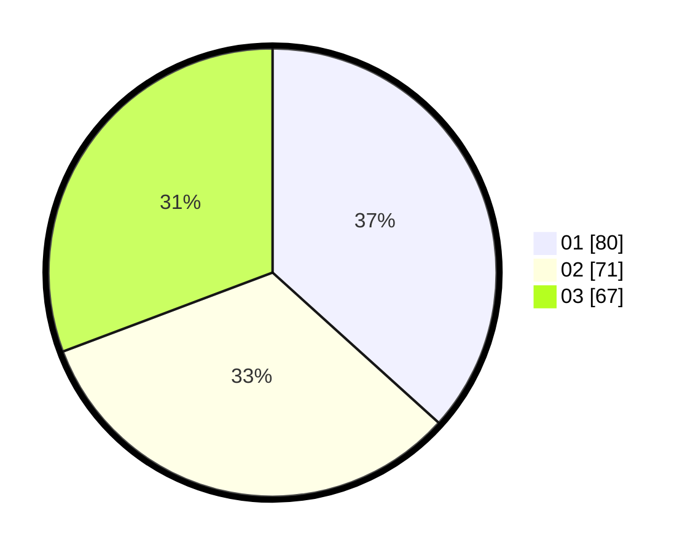

# Hasil

Hasil perolehan suara paslon dapat dilihat pada file paslon-01.txt, paslon-02.txt, dan paslon-03.txt.

Jika tidak ada, artinya data tersebut belum ada pada SIREKAP.

## Perolehan Suara

 * Paslon 01: **80**.
 * Paslon 02: **71**.
 * Paslon 03: **67**.

## Foto C Plano

https://sirekap-obj-formc.kpu.go.id/5462/pemilu/ppwp/31/73/08/10/03/3173081003024-20240214-230350--509c0f31-0092-4df9-8b30-bc3afa4e768d.jpg

https://sirekap-obj-formc.kpu.go.id/5462/pemilu/ppwp/31/73/08/10/03/3173081003024-20240214-230315--f5eaf63d-d290-4d0c-b839-58bc053f0456.jpg

https://sirekap-obj-formc.kpu.go.id/5462/pemilu/ppwp/31/73/08/10/03/3173081003024-20240214-230414--c11f15f5-acc1-498d-aefb-c00d521c155d.jpg
