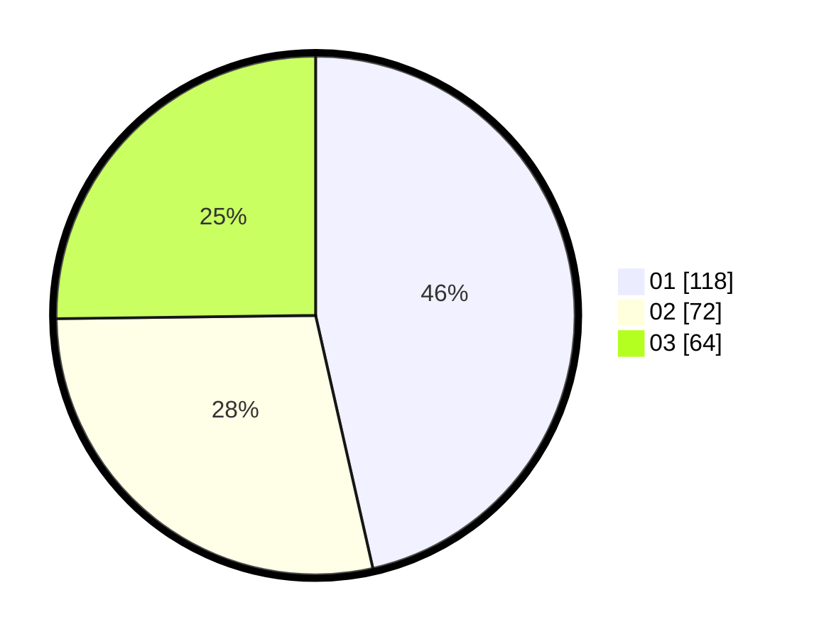

# Hasil

Hasil perolehan suara paslon dapat dilihat pada file paslon-01.txt, paslon-02.txt, dan paslon-03.txt.

Jika tidak ada, artinya data tersebut belum ada pada SIREKAP.

## Perolehan Suara

 * Paslon 01: **118**.
 * Paslon 02: **72**.
 * Paslon 03: **64**.

## Foto C Plano

https://sirekap-obj-formc.kpu.go.id/535b/pemilu/ppwp/31/73/08/10/03/3173081003028-20240215-005150--73de2d8a-1df3-4fef-871a-df9eb707735b.jpg

https://sirekap-obj-formc.kpu.go.id/535b/pemilu/ppwp/31/73/08/10/03/3173081003028-20240215-005229--ddae1d68-5f35-4ccc-84e5-2aec568c38c1.jpg

https://sirekap-obj-formc.kpu.go.id/535b/pemilu/ppwp/31/73/08/10/03/3173081003028-20240215-005248--16644617-47b2-4471-8b76-d191af40d37a.jpg

## DATA PEMILIH TETAP

Jumlah pemilih dalam DPT: **294**.
 * L: **142**.
 * P: **152**.

## DATA PENGGUNA HAK PILIH

Jumlah pengguna hak pilih dalam DPT: **254**.
 * L: **119**.
 * P: **135**.

Jumlah pengguna hak pilih dalam DPTb: **0**.
 * L: **0**.
 * P: **0**.

Jumlah pengguna hak pilih dalam DPK: **3**.
 * L: **1**.
 * P: **2**.

Jumlah pengguna hak pilih: **257**.
 * L: **120**.
 * P: **137**.

## JUMLAH SUARA SAH DAN TIDAK SAH

JUMLAH SELURUH SUARA SAH: **254**.

JUMLAH SUARA TIDAK SAH: **3**.

JUMLAH SELURUH SUARA SAH DAN SUARA TIDAK SAH: **257**.
