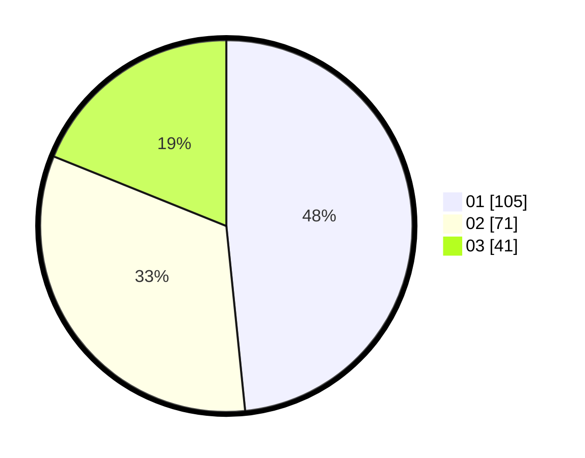

# Hasil

Hasil perolehan suara paslon dapat dilihat pada file paslon-01.txt, paslon-02.txt, dan paslon-03.txt.

Jika tidak ada, artinya data tersebut belum ada pada SIREKAP.

## Perolehan Suara

 * Paslon 01: **105**.
 * Paslon 02: **71**.
 * Paslon 03: **41**.

## Foto C Plano

https://sirekap-obj-formc.kpu.go.id/6645/pemilu/ppwp/31/73/08/10/03/3173081003029-20240214-223149--f987b42c-ae3f-4e09-aac1-58963d1fabb4.jpg

https://sirekap-obj-formc.kpu.go.id/6645/pemilu/ppwp/31/73/08/10/03/3173081003029-20240214-223317--c8356a60-55e9-4cfa-be16-34b8b9465c94.jpg

https://sirekap-obj-formc.kpu.go.id/6645/pemilu/ppwp/31/73/08/10/03/3173081003029-20240214-223434--faab9925-5934-4489-8a6f-b00a496d199e.jpg
