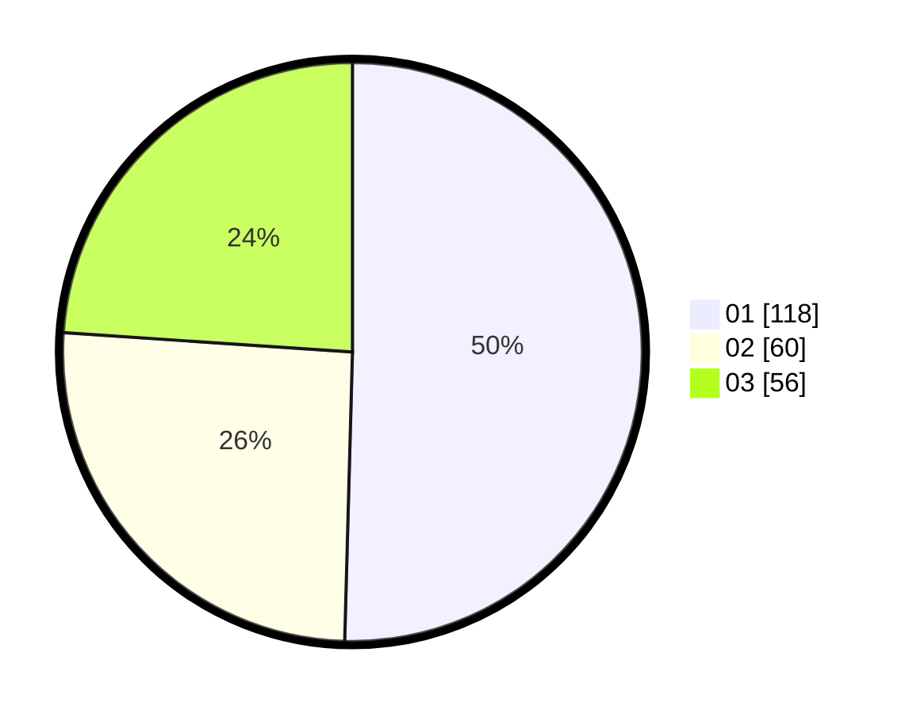

# Hasil

Hasil perolehan suara paslon dapat dilihat pada file paslon-01.txt, paslon-02.txt, dan paslon-03.txt.

Jika tidak ada, artinya data tersebut belum ada pada SIREKAP.

## Perolehan Suara

 * Paslon 01: **118**.
 * Paslon 02: **60**.
 * Paslon 03: **56**.

## Foto C Plano

https://sirekap-obj-formc.kpu.go.id/141d/pemilu/ppwp/31/73/08/10/03/3173081003037-20240216-025433--b01508da-9cc5-49ae-9e60-a0f5230d4ce9.jpg

https://sirekap-obj-formc.kpu.go.id/141d/pemilu/ppwp/31/73/08/10/03/3173081003037-20240216-025437--fffcef52-0a14-46d3-84c3-dd4a750448ad.jpg

https://sirekap-obj-formc.kpu.go.id/141d/pemilu/ppwp/31/73/08/10/03/3173081003037-20240216-025435--ece12784-ba3c-4212-a098-e622b875eb17.jpg

## DATA PEMILIH TETAP

Jumlah pemilih dalam DPT: **270**.
 * L: **140**.
 * P: **130**.

## DATA PENGGUNA HAK PILIH

Jumlah pengguna hak pilih dalam DPT: **234**.
 * L: **123**.
 * P: **111**.

Jumlah pengguna hak pilih dalam DPTb: **4**.
 * L: **2**.
 * P: **2**.

Jumlah pengguna hak pilih dalam DPK: **0**.
 * L: **0**.
 * P: **0**.

Jumlah pengguna hak pilih: **238**.
 * L: **125**.
 * P: **113**.

## JUMLAH SUARA SAH DAN TIDAK SAH

JUMLAH SELURUH SUARA SAH: **234**.

JUMLAH SUARA TIDAK SAH: **4**.

JUMLAH SELURUH SUARA SAH DAN SUARA TIDAK SAH: **238**.
