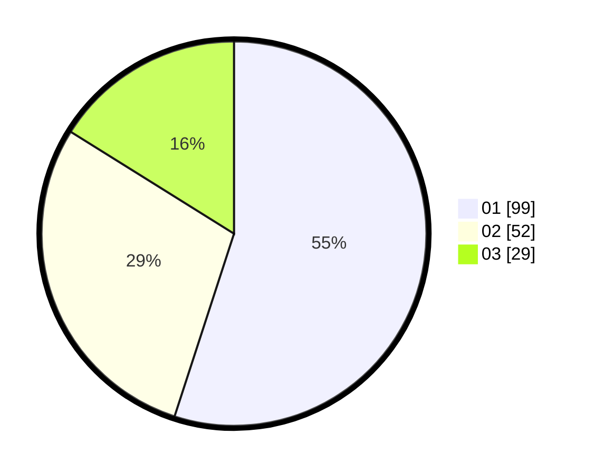

# Hasil

Hasil perolehan suara paslon dapat dilihat pada file paslon-01.txt, paslon-02.txt, dan paslon-03.txt.

Jika tidak ada, artinya data tersebut belum ada pada SIREKAP.

## Perolehan Suara

 * Paslon 01: **99**.
 * Paslon 02: **52**.
 * Paslon 03: **29**.

## Foto C Plano

https://sirekap-obj-formc.kpu.go.id/7a30/pemilu/ppwp/31/73/08/10/03/3173081003038-20240216-015414--881c73e2-b4f3-479b-9f80-be9649da4c42.jpg

https://sirekap-obj-formc.kpu.go.id/7a30/pemilu/ppwp/31/73/08/10/03/3173081003038-20240216-015424--63e01c78-842d-4c09-ae1b-e3c8f57392e8.jpg

https://sirekap-obj-formc.kpu.go.id/7a30/pemilu/ppwp/31/73/08/10/03/3173081003038-20240216-015419--647f6ef3-4654-4f28-81ab-402a7997d6fc.jpg

## DATA PEMILIH TETAP

Jumlah pemilih dalam DPT: **217**.
 * L: **105**.
 * P: **112**.

## DATA PENGGUNA HAK PILIH

Jumlah pengguna hak pilih dalam DPT: **183**.
 * L: **87**.
 * P: **96**.

Jumlah pengguna hak pilih dalam DPTb: **0**.
 * L: **0**.
 * P: **0**.

Jumlah pengguna hak pilih dalam DPK: **2**.
 * L: **2**.
 * P: **0**.

Jumlah pengguna hak pilih: **185**.
 * L: **89**.
 * P: **96**.

## JUMLAH SUARA SAH DAN TIDAK SAH

JUMLAH SELURUH SUARA SAH: **180**.

JUMLAH SUARA TIDAK SAH: **5**.

JUMLAH SELURUH SUARA SAH DAN SUARA TIDAK SAH: **185**.
