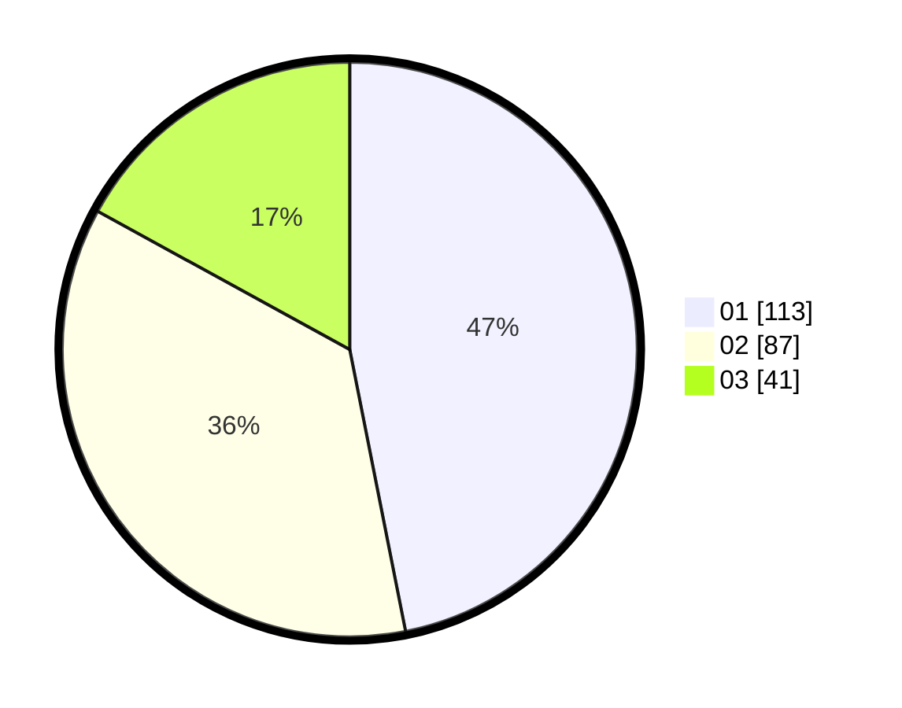

# Hasil

Hasil perolehan suara paslon dapat dilihat pada file paslon-01.txt, paslon-02.txt, dan paslon-03.txt.

Jika tidak ada, artinya data tersebut belum ada pada SIREKAP.

## Perolehan Suara

 * Paslon 01: **113**.
 * Paslon 02: **87**.
 * Paslon 03: **41**.

## Foto C Plano

https://sirekap-obj-formc.kpu.go.id/0230/pemilu/ppwp/31/73/08/10/03/3173081003039-20240216-080232--6a8497b4-4e1c-4c83-acb8-fbce8e145737.jpg

https://sirekap-obj-formc.kpu.go.id/0230/pemilu/ppwp/31/73/08/10/03/3173081003039-20240216-080234--d99a6d21-4a04-40f3-b6a6-a55fc70b0452.jpg

https://sirekap-obj-formc.kpu.go.id/0230/pemilu/ppwp/31/73/08/10/03/3173081003039-20240216-080233--665fd148-c3cb-42d2-b904-15f8ecb9a448.jpg

## DATA PEMILIH TETAP

Jumlah pemilih dalam DPT: **286**.
 * L: **147**.
 * P: **139**.

## DATA PENGGUNA HAK PILIH

Jumlah pengguna hak pilih dalam DPT: **233**.
 * L: **117**.
 * P: **116**.

Jumlah pengguna hak pilih dalam DPTb: **2**.
 * L: **1**.
 * P: **1**.

Jumlah pengguna hak pilih dalam DPK: **10**.
 * L: **4**.
 * P: **6**.

Jumlah pengguna hak pilih: **245**.
 * L: **122**.
 * P: **123**.

## JUMLAH SUARA SAH DAN TIDAK SAH

JUMLAH SELURUH SUARA SAH: **241**.

JUMLAH SUARA TIDAK SAH: **4**.

JUMLAH SELURUH SUARA SAH DAN SUARA TIDAK SAH: **245**.
