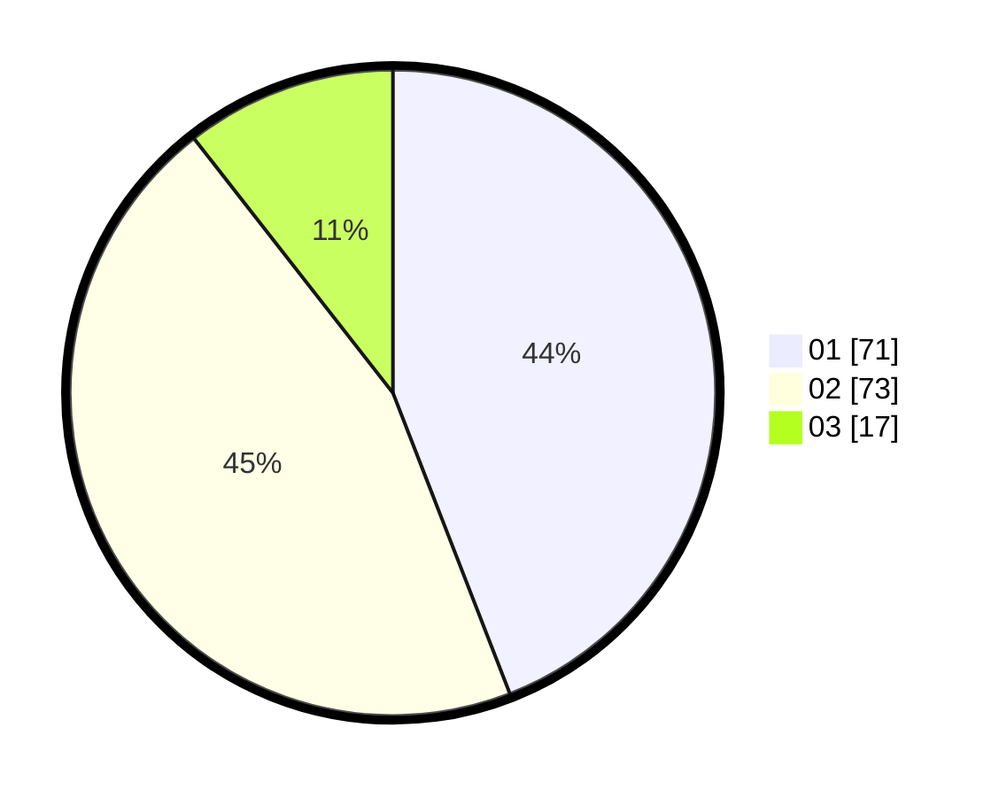

# Hasil

Hasil perolehan suara paslon dapat dilihat pada file paslon-01.txt, paslon-02.txt, dan paslon-03.txt.

Jika tidak ada, artinya data tersebut belum ada pada SIREKAP.

## Perolehan Suara

 * Paslon 01: **71**.
 * Paslon 02: **73**.
 * Paslon 03: **17**.

## Foto C Plano

https://sirekap-obj-formc.kpu.go.id/3b43/pemilu/ppwp/31/73/08/10/03/3173081003042-20240214-155730--c2c7e5f3-334c-4920-81a3-8a12159aed7c.jpg

https://sirekap-obj-formc.kpu.go.id/3b43/pemilu/ppwp/31/73/08/10/03/3173081003042-20240214-193548--56f3496a-a472-4c9e-aef9-ec4fbb00fe18.jpg

https://sirekap-obj-formc.kpu.go.id/3b43/pemilu/ppwp/31/73/08/10/03/3173081003042-20240214-160057--0cb79dc1-c07e-471f-8593-018e361a98c6.jpg

## DATA PEMILIH TETAP

Jumlah pemilih dalam DPT: **234**.
 * L: **108**.
 * P: **126**.

## DATA PENGGUNA HAK PILIH

Jumlah pengguna hak pilih dalam DPT: **161**.
 * L: **77**.
 * P: **84**.

Jumlah pengguna hak pilih dalam DPTb: **1**.
 * L: **1**.
 * P: **0**.

Jumlah pengguna hak pilih dalam DPK: **0**.
 * L: **0**.
 * P: **0**.

Jumlah pengguna hak pilih: **162**.
 * L: **78**.
 * P: **84**.

## JUMLAH SUARA SAH DAN TIDAK SAH

JUMLAH SELURUH SUARA SAH: **161**.

JUMLAH SUARA TIDAK SAH: **1**.

JUMLAH SELURUH SUARA SAH DAN SUARA TIDAK SAH: **162**.
