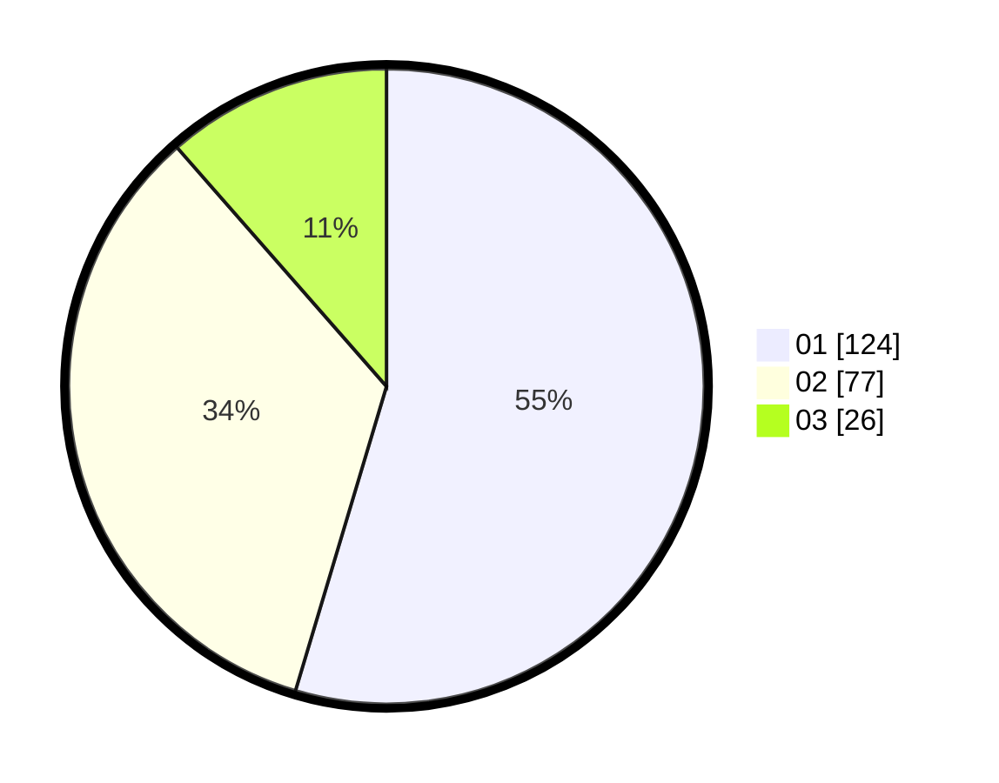

# Hasil

Hasil perolehan suara paslon dapat dilihat pada file paslon-01.txt, paslon-02.txt, dan paslon-03.txt.

Jika tidak ada, artinya data tersebut belum ada pada SIREKAP.

## Perolehan Suara

 * Paslon 01: **124**.
 * Paslon 02: **77**.
 * Paslon 03: **26**.

## Foto C Plano

https://sirekap-obj-formc.kpu.go.id/8156/pemilu/ppwp/31/73/08/10/03/3173081003043-20240216-050615--cefcc527-b24e-42b4-9088-ff8be3e323bc.jpg

https://sirekap-obj-formc.kpu.go.id/8156/pemilu/ppwp/31/73/08/10/03/3173081003043-20240216-050629--03e6e910-8035-464c-aee8-103b5dc6f17d.jpg

https://sirekap-obj-formc.kpu.go.id/8156/pemilu/ppwp/31/73/08/10/03/3173081003043-20240216-050623--bcabe923-7da9-4f39-8bcf-9e923db4a83b.jpg

## DATA PEMILIH TETAP

Jumlah pemilih dalam DPT: **272**.
 * L: **127**.
 * P: **145**.

## DATA PENGGUNA HAK PILIH

Jumlah pengguna hak pilih dalam DPT: **222**.
 * L: **104**.
 * P: **118**.

Jumlah pengguna hak pilih dalam DPTb: **7**.
 * L: **1**.
 * P: **6**.

Jumlah pengguna hak pilih dalam DPK: **0**.
 * L: **0**.
 * P: **0**.

Jumlah pengguna hak pilih: **229**.
 * L: **105**.
 * P: **124**.

## JUMLAH SUARA SAH DAN TIDAK SAH

JUMLAH SELURUH SUARA SAH: **227**.

JUMLAH SUARA TIDAK SAH: **2**.

JUMLAH SELURUH SUARA SAH DAN SUARA TIDAK SAH: **229**.
