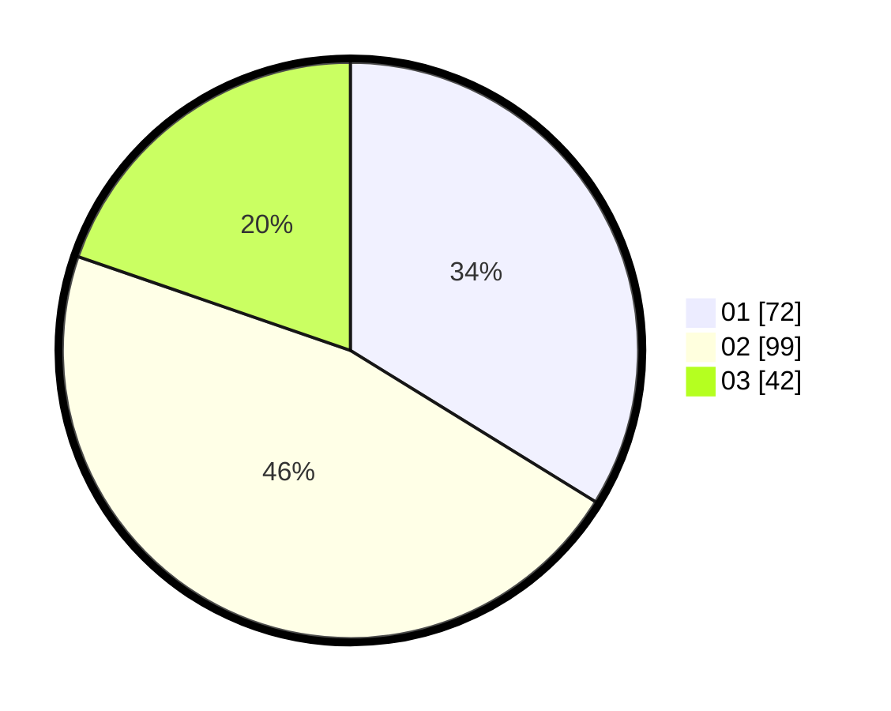

# Hasil

Hasil perolehan suara paslon dapat dilihat pada file paslon-01.txt, paslon-02.txt, dan paslon-03.txt.

Jika tidak ada, artinya data tersebut belum ada pada SIREKAP.

## Perolehan Suara

 * Paslon 01: **72**.
 * Paslon 02: **99**.
 * Paslon 03: **42**.

## Foto C Plano

https://sirekap-obj-formc.kpu.go.id/94f1/pemilu/ppwp/31/73/08/10/03/3173081003047-20240214-185939--b0a2d406-e0b0-4a38-9c68-074cb1c5c87c.jpg

https://sirekap-obj-formc.kpu.go.id/94f1/pemilu/ppwp/31/73/08/10/03/3173081003047-20240214-155707--4457de49-d21e-45e8-bf5e-2a78126e7c8b.jpg

https://sirekap-obj-formc.kpu.go.id/94f1/pemilu/ppwp/31/73/08/10/03/3173081003047-20240214-155923--ab3d73a5-f485-4a45-a178-cafdd1ce379f.jpg
