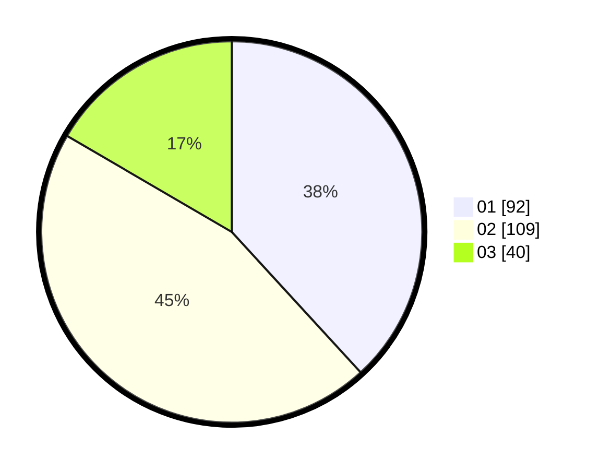

# Hasil

Hasil perolehan suara paslon dapat dilihat pada file paslon-01.txt, paslon-02.txt, dan paslon-03.txt.

Jika tidak ada, artinya data tersebut belum ada pada SIREKAP.

## Perolehan Suara

 * Paslon 01: **92**.
 * Paslon 02: **109**.
 * Paslon 03: **40**.

## Foto C Plano

https://sirekap-obj-formc.kpu.go.id/928a/pemilu/ppwp/31/73/08/10/03/3173081003048-20240214-225625--4960997b-f589-4549-8a70-f998ae9f6fcf.jpg

https://sirekap-obj-formc.kpu.go.id/928a/pemilu/ppwp/31/73/08/10/03/3173081003048-20240214-225739--f11994d2-58d3-474b-bb70-12e3c0e88c6d.jpg

https://sirekap-obj-formc.kpu.go.id/928a/pemilu/ppwp/31/73/08/10/03/3173081003048-20240214-225850--bcff6c4b-8e12-4559-8a93-2966fb6e2198.jpg
