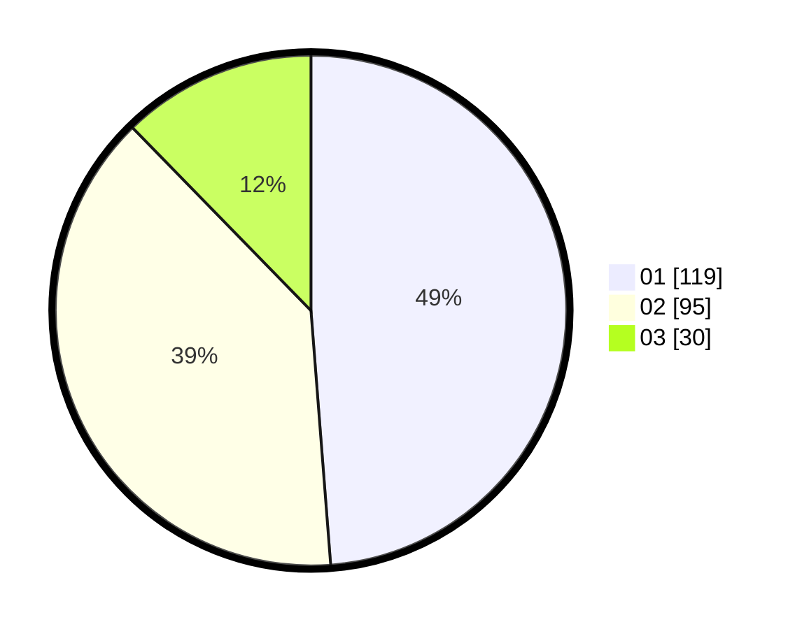

# Hasil

Hasil perolehan suara paslon dapat dilihat pada file paslon-01.txt, paslon-02.txt, dan paslon-03.txt.

Jika tidak ada, artinya data tersebut belum ada pada SIREKAP.

## Perolehan Suara

 * Paslon 01: **119**.
 * Paslon 02: **95**.
 * Paslon 03: **30**.

## Foto C Plano

https://sirekap-obj-formc.kpu.go.id/816e/pemilu/ppwp/31/73/08/10/03/3173081003051-20240214-155128--86ff526d-b772-41fe-bab8-01426cbb7c75.jpg

https://sirekap-obj-formc.kpu.go.id/816e/pemilu/ppwp/31/73/08/10/03/3173081003051-20240214-155458--e7ee4bc6-28a7-4bcd-96e3-5af71ff44bfc.jpg

https://sirekap-obj-formc.kpu.go.id/816e/pemilu/ppwp/31/73/08/10/03/3173081003051-20240214-160102--c8847c9d-d84b-45d3-b010-0c62b5e8f5e5.jpg

## DATA PEMILIH TETAP

Jumlah pemilih dalam DPT: **295**.
 * L: **143**.
 * P: **152**.

## DATA PENGGUNA HAK PILIH

Jumlah pengguna hak pilih dalam DPT: **243**.
 * L: **119**.
 * P: **124**.

Jumlah pengguna hak pilih dalam DPTb: **2**.
 * L: **1**.
 * P: **1**.

Jumlah pengguna hak pilih dalam DPK: **0**.
 * L: **0**.
 * P: **0**.

Jumlah pengguna hak pilih: **245**.
 * L: **120**.
 * P: **125**.

## JUMLAH SUARA SAH DAN TIDAK SAH

JUMLAH SELURUH SUARA SAH: **244**.

JUMLAH SUARA TIDAK SAH: **1**.

JUMLAH SELURUH SUARA SAH DAN SUARA TIDAK SAH: **245**.
