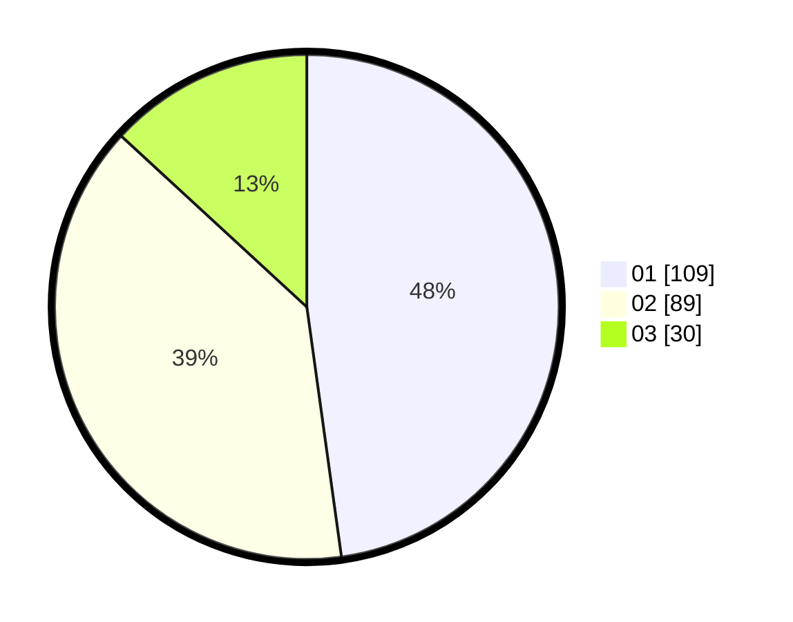

# Hasil

Hasil perolehan suara paslon dapat dilihat pada file paslon-01.txt, paslon-02.txt, dan paslon-03.txt.

Jika tidak ada, artinya data tersebut belum ada pada SIREKAP.

## Perolehan Suara

 * Paslon 01: **109**.
 * Paslon 02: **89**.
 * Paslon 03: **30**.

## Foto C Plano

https://sirekap-obj-formc.kpu.go.id/616c/pemilu/ppwp/31/73/08/10/03/3173081003053-20240215-175509--9edb2037-979a-45e1-ac0f-d1e7647a8839.jpg

https://sirekap-obj-formc.kpu.go.id/616c/pemilu/ppwp/31/73/08/10/03/3173081003053-20240215-175519--1c879f62-ba11-4165-94fa-307c0bcc21c0.jpg

https://sirekap-obj-formc.kpu.go.id/616c/pemilu/ppwp/31/73/08/10/03/3173081003053-20240215-175524--c5366129-e2b1-4c39-878e-6cd6dd4b0c47.jpg
