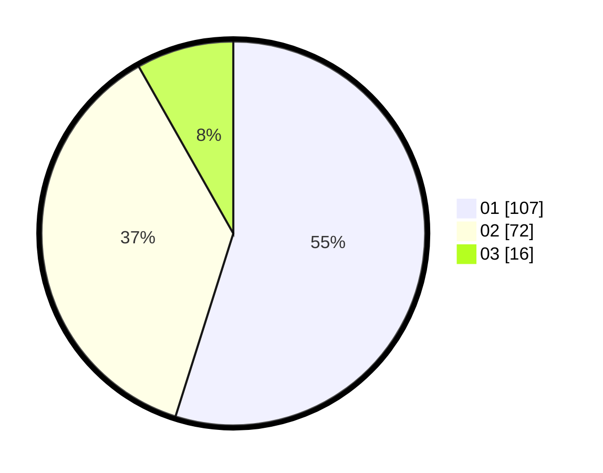

# Hasil

Hasil perolehan suara paslon dapat dilihat pada file paslon-01.txt, paslon-02.txt, dan paslon-03.txt.

Jika tidak ada, artinya data tersebut belum ada pada SIREKAP.

## Perolehan Suara

 * Paslon 01: **107**.
 * Paslon 02: **72**.
 * Paslon 03: **16**.

## Foto C Plano

https://sirekap-obj-formc.kpu.go.id/d713/pemilu/ppwp/31/73/08/10/03/3173081003055-20240214-213102--f0d2a11d-daa8-435c-9383-8f88d4c80776.jpg

https://sirekap-obj-formc.kpu.go.id/d713/pemilu/ppwp/31/73/08/10/03/3173081003055-20240214-213148--a489a0aa-9c12-4311-b705-ea0795fb575a.jpg

https://sirekap-obj-formc.kpu.go.id/d713/pemilu/ppwp/31/73/08/10/03/3173081003055-20240214-213226--b0f4d302-b725-45c2-affe-d7973d7e2ed2.jpg
