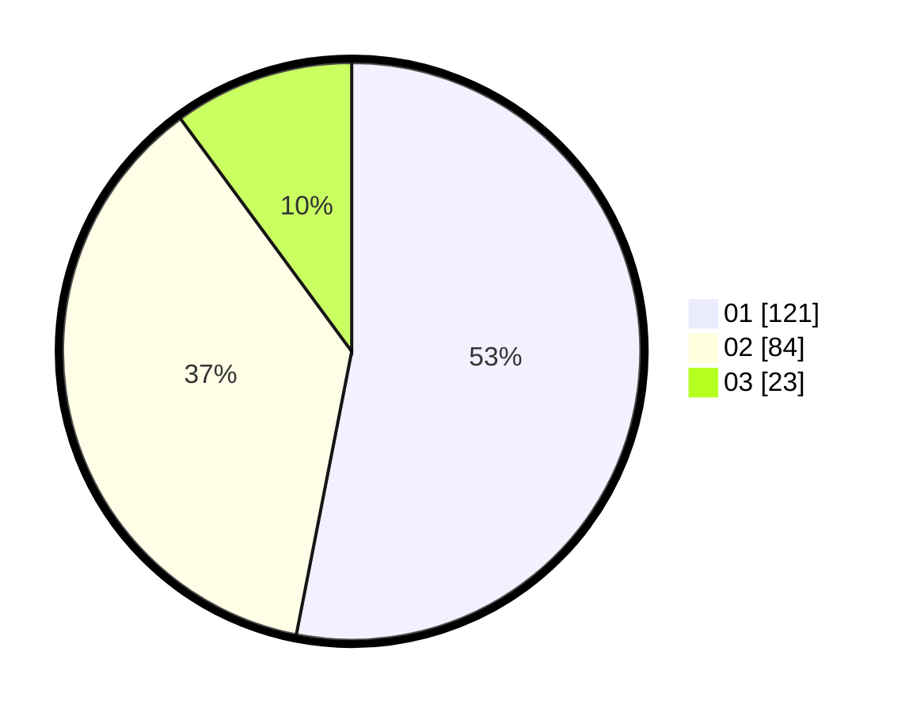

# Hasil

Hasil perolehan suara paslon dapat dilihat pada file paslon-01.txt, paslon-02.txt, dan paslon-03.txt.

Jika tidak ada, artinya data tersebut belum ada pada SIREKAP.

## Perolehan Suara

 * Paslon 01: **121**.
 * Paslon 02: **84**.
 * Paslon 03: **23**.

## Foto C Plano

https://sirekap-obj-formc.kpu.go.id/7b56/pemilu/ppwp/31/73/08/10/03/3173081003056-20240214-191557--2ce4cc4f-0b31-4aa9-af76-646e4ee93377.jpg

https://sirekap-obj-formc.kpu.go.id/7b56/pemilu/ppwp/31/73/08/10/03/3173081003056-20240214-191708--2e872ca3-95bf-425d-be3a-a245f03576c7.jpg

https://sirekap-obj-formc.kpu.go.id/7b56/pemilu/ppwp/31/73/08/10/03/3173081003056-20240214-191729--37ca08ed-51a2-42c3-9d25-5f06dee1995c.jpg

## DATA PEMILIH TETAP

Jumlah pemilih dalam DPT: **282**.
 * L: **144**.
 * P: **138**.

## DATA PENGGUNA HAK PILIH

Jumlah pengguna hak pilih dalam DPT: **228**.
 * L: **110**.
 * P: **118**.

Jumlah pengguna hak pilih dalam DPTb: **2**.
 * L: **0**.
 * P: **2**.

Jumlah pengguna hak pilih dalam DPK: **0**.
 * L: **0**.
 * P: **0**.

Jumlah pengguna hak pilih: **230**.
 * L: **110**.
 * P: **120**.

## JUMLAH SUARA SAH DAN TIDAK SAH

JUMLAH SELURUH SUARA SAH: **228**.

JUMLAH SUARA TIDAK SAH: **2**.

JUMLAH SELURUH SUARA SAH DAN SUARA TIDAK SAH: **230**.
