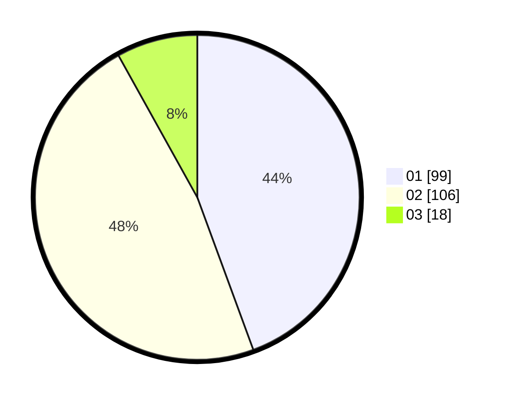

# Hasil

Hasil perolehan suara paslon dapat dilihat pada file paslon-01.txt, paslon-02.txt, dan paslon-03.txt.

Jika tidak ada, artinya data tersebut belum ada pada SIREKAP.

## Perolehan Suara

 * Paslon 01: **99**.
 * Paslon 02: **106**.
 * Paslon 03: **18**.

## Foto C Plano

https://sirekap-obj-formc.kpu.go.id/bd8e/pemilu/ppwp/31/73/08/10/03/3173081003057-20240214-155914--a3819593-c1f9-4253-a89c-9daeb2208f38.jpg

https://sirekap-obj-formc.kpu.go.id/bd8e/pemilu/ppwp/31/73/08/10/03/3173081003057-20240214-155752--9ebd8b07-8596-4adc-9c3b-78c7f2fbe97e.jpg

https://sirekap-obj-formc.kpu.go.id/bd8e/pemilu/ppwp/31/73/08/10/03/3173081003057-20240214-160103--c49c1760-0e4b-42cf-89c2-fc967685fa4f.jpg
