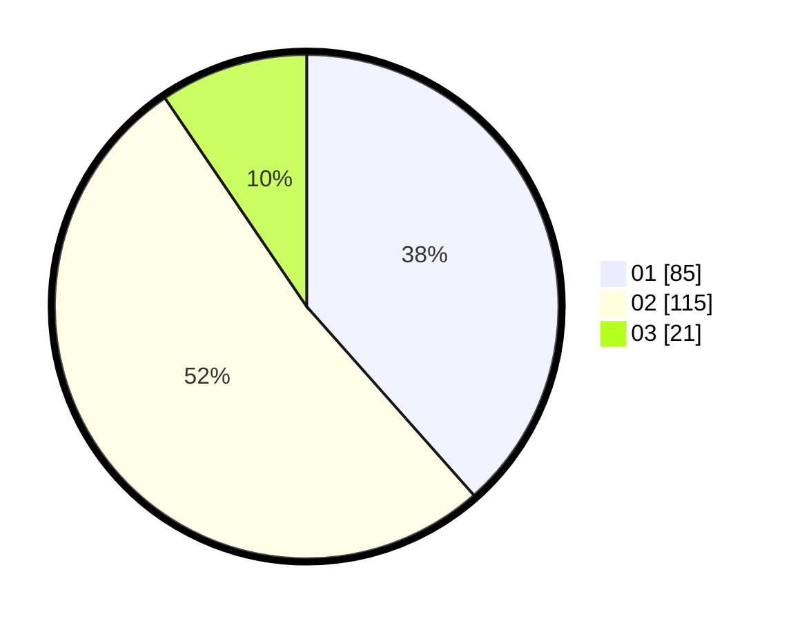

# Hasil

Hasil perolehan suara paslon dapat dilihat pada file paslon-01.txt, paslon-02.txt, dan paslon-03.txt.

Jika tidak ada, artinya data tersebut belum ada pada SIREKAP.

## Perolehan Suara

 * Paslon 01: **85**.
 * Paslon 02: **115**.
 * Paslon 03: **21**.

## Foto C Plano

https://sirekap-obj-formc.kpu.go.id/67aa/pemilu/ppwp/31/73/08/10/03/3173081003058-20240215-000306--a51a7bb3-9254-4110-a6b0-2267f0c761fc.jpg

https://sirekap-obj-formc.kpu.go.id/67aa/pemilu/ppwp/31/73/08/10/03/3173081003058-20240215-000505--786615f1-6671-4814-88a5-fda365862221.jpg

https://sirekap-obj-formc.kpu.go.id/67aa/pemilu/ppwp/31/73/08/10/03/3173081003058-20240215-001021--3c93dab7-4f66-4431-ad42-bc3e4d7ad8b0.jpg
