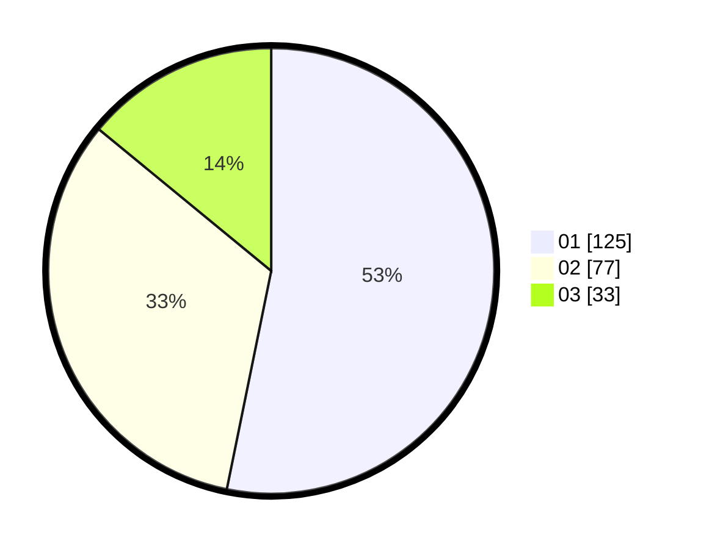

# Hasil

Hasil perolehan suara paslon dapat dilihat pada file paslon-01.txt, paslon-02.txt, dan paslon-03.txt.

Jika tidak ada, artinya data tersebut belum ada pada SIREKAP.

## Perolehan Suara

 * Paslon 01: **125**.
 * Paslon 02: **77**.
 * Paslon 03: **33**.

## Foto C Plano

https://sirekap-obj-formc.kpu.go.id/b847/pemilu/ppwp/31/73/08/10/03/3173081003059-20240214-215057--8ebf1ff9-83b9-412e-8e75-b1dc7675b88f.jpg

https://sirekap-obj-formc.kpu.go.id/b847/pemilu/ppwp/31/73/08/10/03/3173081003059-20240214-214050--35fec53f-764e-46ae-9cba-e09d59aff033.jpg

https://sirekap-obj-formc.kpu.go.id/b847/pemilu/ppwp/31/73/08/10/03/3173081003059-20240214-215620--36b75ed0-ec81-472f-9c22-d952304fb30c.jpg
