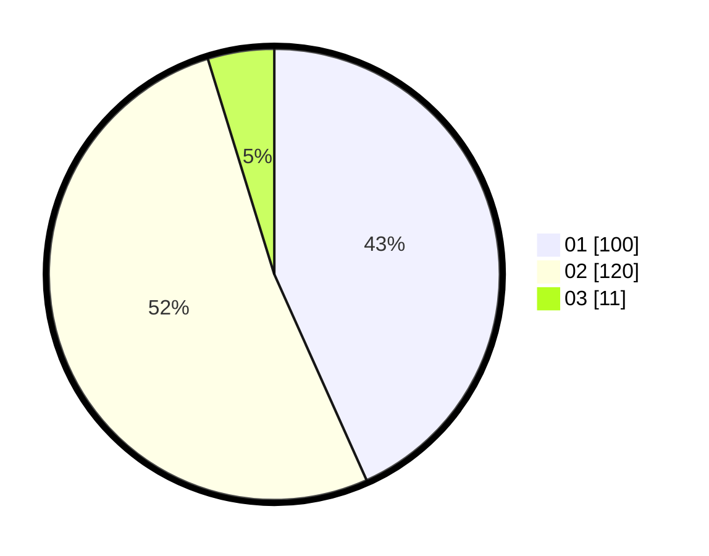

# Hasil

Hasil perolehan suara paslon dapat dilihat pada file paslon-01.txt, paslon-02.txt, dan paslon-03.txt.

Jika tidak ada, artinya data tersebut belum ada pada SIREKAP.

## Perolehan Suara

 * Paslon 01: **100**.
 * Paslon 02: **120**.
 * Paslon 03: **11**.

## Foto C Plano

https://sirekap-obj-formc.kpu.go.id/ebac/pemilu/ppwp/31/73/08/10/03/3173081003067-20240216-115819--c339ebb9-4542-475f-a074-fe73cf24c891.jpg

https://sirekap-obj-formc.kpu.go.id/ebac/pemilu/ppwp/31/73/08/10/03/3173081003067-20240216-115824--52d5adec-3e79-42ba-bcae-1b01f53ba84e.jpg

https://sirekap-obj-formc.kpu.go.id/ebac/pemilu/ppwp/31/73/08/10/03/3173081003067-20240216-115822--aa5cece0-b958-410e-b3f9-ea30db386c7c.jpg

## DATA PEMILIH TETAP

Jumlah pemilih dalam DPT: **284**.
 * L: **128**.
 * P: **156**.

## DATA PENGGUNA HAK PILIH

Jumlah pengguna hak pilih dalam DPT: **230**.
 * L: **102**.
 * P: **128**.

Jumlah pengguna hak pilih dalam DPTb: **2**.
 * L: **1**.
 * P: **1**.

Jumlah pengguna hak pilih dalam DPK: **2**.
 * L: **1**.
 * P: **1**.

Jumlah pengguna hak pilih: **234**.
 * L: **104**.
 * P: **130**.

## JUMLAH SUARA SAH DAN TIDAK SAH

JUMLAH SELURUH SUARA SAH: **231**.

JUMLAH SUARA TIDAK SAH: **3**.

JUMLAH SELURUH SUARA SAH DAN SUARA TIDAK SAH: **234**.
