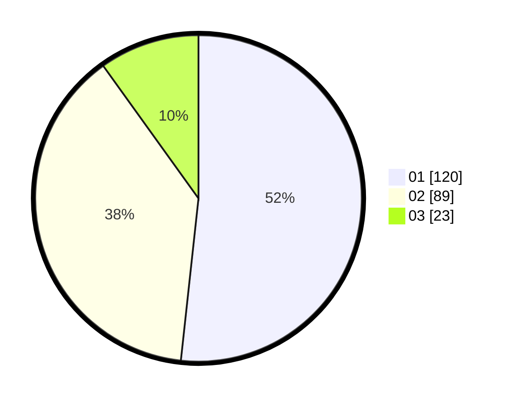

# Hasil

Hasil perolehan suara paslon dapat dilihat pada file paslon-01.txt, paslon-02.txt, dan paslon-03.txt.

Jika tidak ada, artinya data tersebut belum ada pada SIREKAP.

## Perolehan Suara

 * Paslon 01: **120**.
 * Paslon 02: **89**.
 * Paslon 03: **23**.

## Foto C Plano

https://sirekap-obj-formc.kpu.go.id/8179/pemilu/ppwp/31/73/08/10/03/3173081003068-20240216-045605--f141d66d-890e-4a7b-951d-3b91284a32b0.jpg

https://sirekap-obj-formc.kpu.go.id/8179/pemilu/ppwp/31/73/08/10/03/3173081003068-20240216-045607--58ab7f61-884b-4520-a773-db9af02d7e14.jpg

https://sirekap-obj-formc.kpu.go.id/8179/pemilu/ppwp/31/73/08/10/03/3173081003068-20240214-193836--415edb29-ede6-4887-a24c-8d9a1a20d020.jpg

## DATA PEMILIH TETAP

Jumlah pemilih dalam DPT: **285**.
 * L: **141**.
 * P: **144**.

## DATA PENGGUNA HAK PILIH

Jumlah pengguna hak pilih dalam DPT: **232**.
 * L: **110**.
 * P: **122**.

Jumlah pengguna hak pilih dalam DPTb: **0**.
 * L: **0**.
 * P: **0**.

Jumlah pengguna hak pilih dalam DPK: **9**.
 * L: **4**.
 * P: **5**.

Jumlah pengguna hak pilih: **241**.
 * L: **114**.
 * P: **127**.

## JUMLAH SUARA SAH DAN TIDAK SAH

JUMLAH SELURUH SUARA SAH: **232**.

JUMLAH SUARA TIDAK SAH: **9**.

JUMLAH SELURUH SUARA SAH DAN SUARA TIDAK SAH: **241**.
