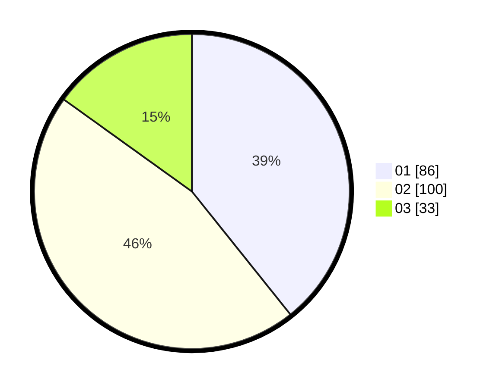

# Hasil

Hasil perolehan suara paslon dapat dilihat pada file paslon-01.txt, paslon-02.txt, dan paslon-03.txt.

Jika tidak ada, artinya data tersebut belum ada pada SIREKAP.

## Perolehan Suara

 * Paslon 01: **86**.
 * Paslon 02: **100**.
 * Paslon 03: **33**.

## Foto C Plano

https://sirekap-obj-formc.kpu.go.id/b0ca/pemilu/ppwp/31/73/08/10/03/3173081003069-20240216-004533--c7868d60-5e1f-4d09-b08b-476203f1a30e.jpg

https://sirekap-obj-formc.kpu.go.id/b0ca/pemilu/ppwp/31/73/08/10/03/3173081003069-20240214-212559--75914a74-02ee-4468-b3bb-512642843cb2.jpg

https://sirekap-obj-formc.kpu.go.id/b0ca/pemilu/ppwp/31/73/08/10/03/3173081003069-20240216-004534--23901ce7-0ff9-4798-b4a4-83b292ae4498.jpg

## DATA PEMILIH TETAP

Jumlah pemilih dalam DPT: **294**.
 * L: **149**.
 * P: **145**.

## DATA PENGGUNA HAK PILIH

Jumlah pengguna hak pilih dalam DPT: **219**.
 * L: **106**.
 * P: **113**.

Jumlah pengguna hak pilih dalam DPTb: **0**.
 * L: **0**.
 * P: **0**.

Jumlah pengguna hak pilih dalam DPK: **2**.
 * L: **1**.
 * P: **1**.

Jumlah pengguna hak pilih: **221**.
 * L: **107**.
 * P: **114**.

## JUMLAH SUARA SAH DAN TIDAK SAH

JUMLAH SELURUH SUARA SAH: **219**.

JUMLAH SUARA TIDAK SAH: **2**.

JUMLAH SELURUH SUARA SAH DAN SUARA TIDAK SAH: **221**.
