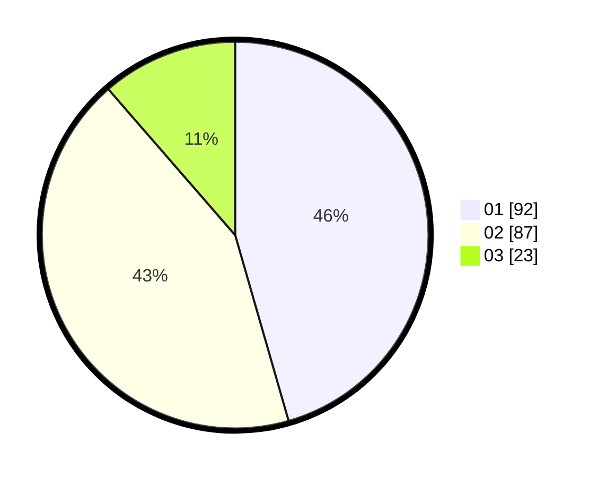

# Hasil

Hasil perolehan suara paslon dapat dilihat pada file paslon-01.txt, paslon-02.txt, dan paslon-03.txt.

Jika tidak ada, artinya data tersebut belum ada pada SIREKAP.

## Perolehan Suara

 * Paslon 01: **92**.
 * Paslon 02: **87**.
 * Paslon 03: **23**.

## Foto C Plano

https://sirekap-obj-formc.kpu.go.id/273c/pemilu/ppwp/31/73/08/10/03/3173081003072-20240214-213622--81b681cf-b5d2-479a-bb94-e1d554356091.jpg

https://sirekap-obj-formc.kpu.go.id/273c/pemilu/ppwp/31/73/08/10/03/3173081003072-20240214-213734--584ddf55-f573-41a2-ad30-f2a5d389316f.jpg

https://sirekap-obj-formc.kpu.go.id/273c/pemilu/ppwp/31/73/08/10/03/3173081003072-20240214-213829--4f1b69cb-4594-456d-b5ec-d8fc0e99c76b.jpg
