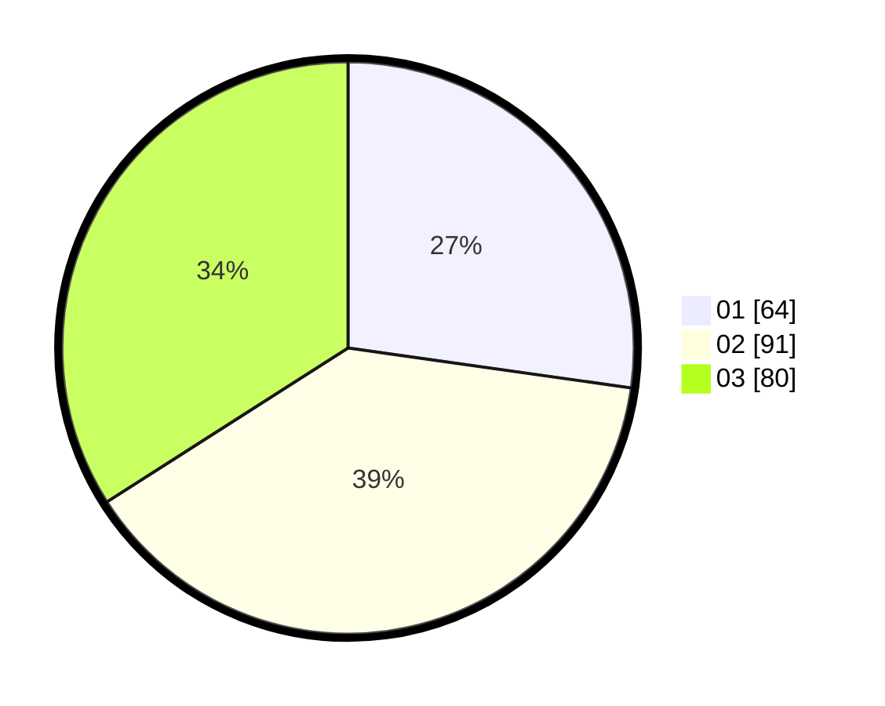

# Hasil

Hasil perolehan suara paslon dapat dilihat pada file paslon-01.txt, paslon-02.txt, dan paslon-03.txt.

Jika tidak ada, artinya data tersebut belum ada pada SIREKAP.

## Perolehan Suara

 * Paslon 01: **64**.
 * Paslon 02: **91**.
 * Paslon 03: **80**.

## Foto C Plano

https://sirekap-obj-formc.kpu.go.id/faa0/pemilu/ppwp/31/73/08/10/03/3173081003080-20240216-133527--fb59f74f-6210-4983-8e4a-9008aa0c8fc9.jpg

https://sirekap-obj-formc.kpu.go.id/faa0/pemilu/ppwp/31/73/08/10/03/3173081003080-20240216-133528--ed3ce588-fe13-41c1-a127-39baebbc7151.jpg

https://sirekap-obj-formc.kpu.go.id/faa0/pemilu/ppwp/31/73/08/10/03/3173081003080-20240216-133528--8f560770-eadc-4a4b-82e5-68a5a3a2ef97.jpg

## DATA PEMILIH TETAP

Jumlah pemilih dalam DPT: **291**.
 * L: **141**.
 * P: **150**.

## DATA PENGGUNA HAK PILIH

Jumlah pengguna hak pilih dalam DPT: **232**.
 * L: **111**.
 * P: **121**.

Jumlah pengguna hak pilih dalam DPTb: **3**.
 * L: **0**.
 * P: **3**.

Jumlah pengguna hak pilih dalam DPK: **5**.
 * L: **2**.
 * P: **3**.

Jumlah pengguna hak pilih: **240**.
 * L: **113**.
 * P: **127**.

## JUMLAH SUARA SAH DAN TIDAK SAH

JUMLAH SELURUH SUARA SAH: **235**.

JUMLAH SUARA TIDAK SAH: **5**.

JUMLAH SELURUH SUARA SAH DAN SUARA TIDAK SAH: **240**.
