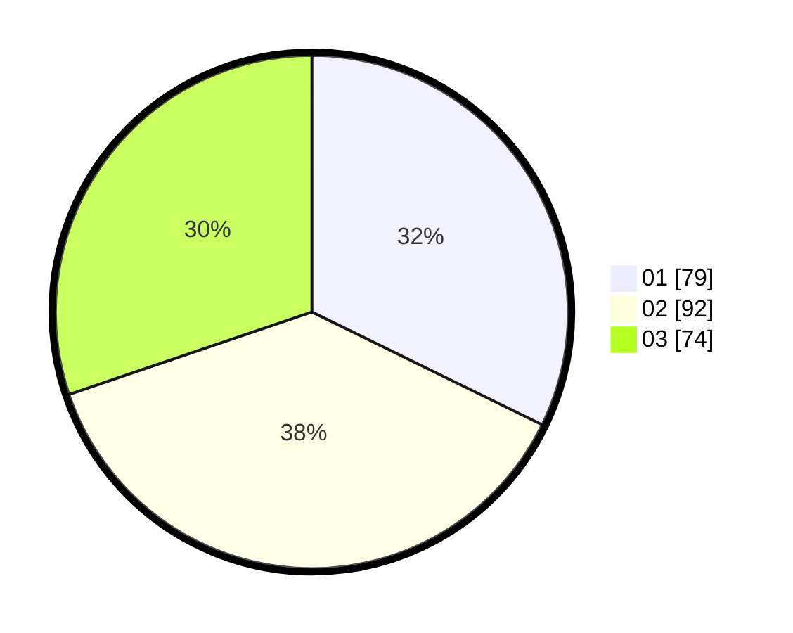

# Hasil

Hasil perolehan suara paslon dapat dilihat pada file paslon-01.txt, paslon-02.txt, dan paslon-03.txt.

Jika tidak ada, artinya data tersebut belum ada pada SIREKAP.

## Perolehan Suara

 * Paslon 01: **79**.
 * Paslon 02: **92**.
 * Paslon 03: **74**.

## Foto C Plano

https://sirekap-obj-formc.kpu.go.id/a7cc/pemilu/ppwp/31/73/08/10/03/3173081003082-20240215-004640--eb355d24-e0e0-48be-8999-d480842d540b.jpg

https://sirekap-obj-formc.kpu.go.id/a7cc/pemilu/ppwp/31/73/08/10/03/3173081003082-20240215-004827--e6d1567a-1d57-404f-b72b-69fcf7b324dd.jpg
