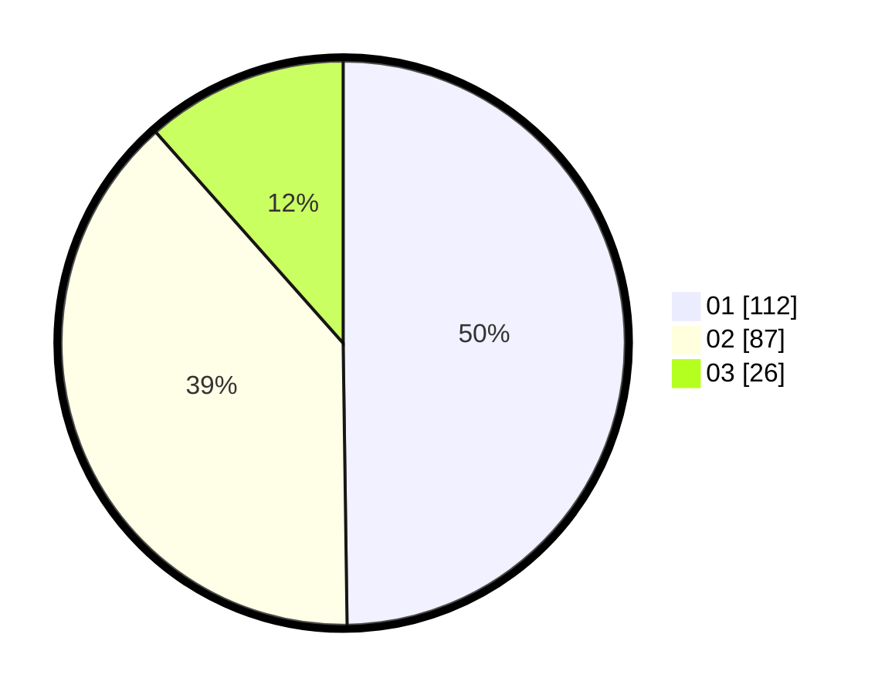

# Hasil

Hasil perolehan suara paslon dapat dilihat pada file paslon-01.txt, paslon-02.txt, dan paslon-03.txt.

Jika tidak ada, artinya data tersebut belum ada pada SIREKAP.

## Perolehan Suara

 * Paslon 01: **112**.
 * Paslon 02: **87**.
 * Paslon 03: **26**.

## Foto C Plano

https://sirekap-obj-formc.kpu.go.id/c3d7/pemilu/ppwp/31/73/08/10/03/3173081003085-20240214-225637--c1c20a1d-cccc-4d34-8053-14d550152681.jpg

https://sirekap-obj-formc.kpu.go.id/c3d7/pemilu/ppwp/31/73/08/10/03/3173081003085-20240214-225747--aa73b926-c083-47ba-b47c-4e1dabe1d19c.jpg

https://sirekap-obj-formc.kpu.go.id/c3d7/pemilu/ppwp/31/73/08/10/03/3173081003085-20240214-233621--795554c3-26e0-47db-81d5-bd00f7a53faa.jpg
