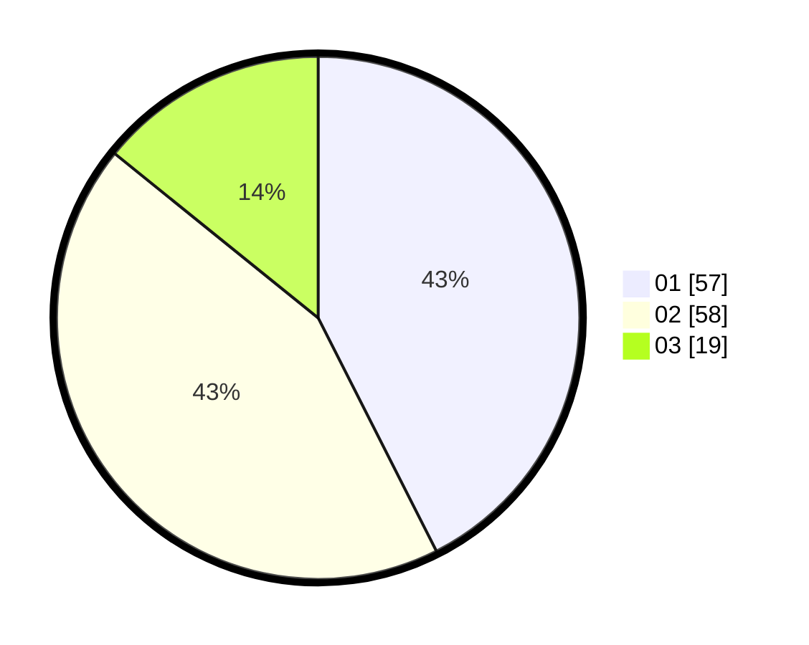

# Hasil

Hasil perolehan suara paslon dapat dilihat pada file paslon-01.txt, paslon-02.txt, dan paslon-03.txt.

Jika tidak ada, artinya data tersebut belum ada pada SIREKAP.

## Perolehan Suara

 * Paslon 01: **57**.
 * Paslon 02: **58**.
 * Paslon 03: **19**.

## Foto C Plano

https://sirekap-obj-formc.kpu.go.id/390c/pemilu/ppwp/31/73/08/10/03/3173081003088-20240214-223303--6c8f5ce4-f560-49af-8de4-ba66e74cee70.jpg

https://sirekap-obj-formc.kpu.go.id/390c/pemilu/ppwp/31/73/08/10/03/3173081003088-20240214-222208--53165a4d-9e8b-4099-81c7-15aa291d61a2.jpg

https://sirekap-obj-formc.kpu.go.id/390c/pemilu/ppwp/31/73/08/10/03/3173081003088-20240214-222641--6f4d1d4f-6b76-40f0-a728-746704574a3d.jpg
