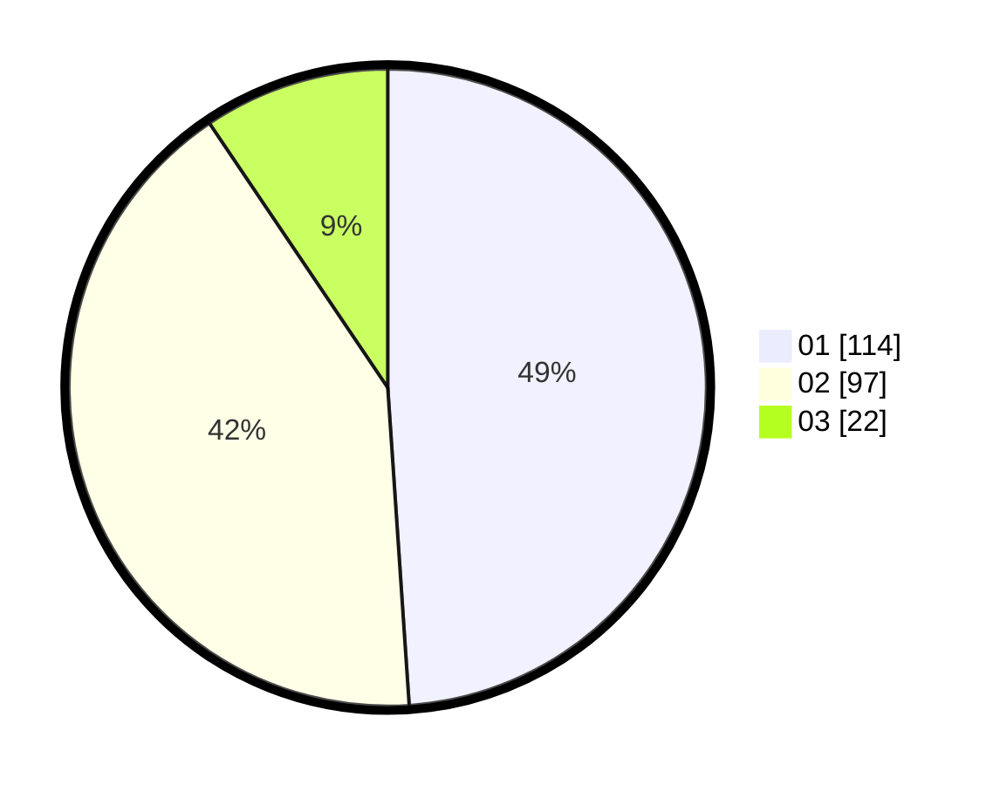

# Hasil

Hasil perolehan suara paslon dapat dilihat pada file paslon-01.txt, paslon-02.txt, dan paslon-03.txt.

Jika tidak ada, artinya data tersebut belum ada pada SIREKAP.

## Perolehan Suara

 * Paslon 01: **114**.
 * Paslon 02: **97**.
 * Paslon 03: **22**.

## Foto C Plano

https://sirekap-obj-formc.kpu.go.id/efb1/pemilu/ppwp/31/73/08/10/03/3173081003090-20240215-001357--0b4f03a8-ca1c-42f8-885c-0bba2d594968.jpg

https://sirekap-obj-formc.kpu.go.id/efb1/pemilu/ppwp/31/73/08/10/03/3173081003090-20240215-001258--04071a6b-434a-4cae-a6eb-f84da8b65c0e.jpg

https://sirekap-obj-formc.kpu.go.id/efb1/pemilu/ppwp/31/73/08/10/03/3173081003090-20240215-001222--971d28f6-263b-4541-8ff0-4374398ab219.jpg
