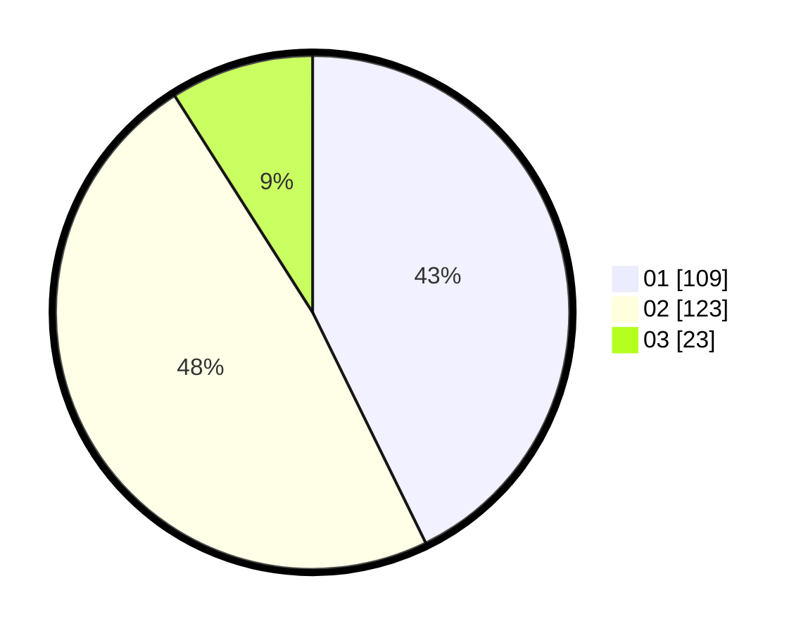

# Hasil

Hasil perolehan suara paslon dapat dilihat pada file paslon-01.txt, paslon-02.txt, dan paslon-03.txt.

Jika tidak ada, artinya data tersebut belum ada pada SIREKAP.

## Perolehan Suara

 * Paslon 01: **109**.
 * Paslon 02: **123**.
 * Paslon 03: **23**.

## Foto C Plano

https://sirekap-obj-formc.kpu.go.id/5965/pemilu/ppwp/31/73/08/10/03/3173081003091-20240214-230915--88196713-7022-4716-b929-5319da56fad3.jpg

https://sirekap-obj-formc.kpu.go.id/5965/pemilu/ppwp/31/73/08/10/03/3173081003091-20240214-231055--ea5bccc8-b131-4899-9f8d-36cbc18ab4c7.jpg

https://sirekap-obj-formc.kpu.go.id/5965/pemilu/ppwp/31/73/08/10/03/3173081003091-20240214-231149--df2745aa-03dd-4a20-8631-0fe9a79c4e64.jpg
