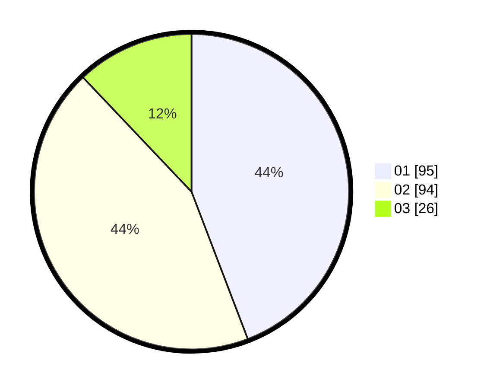

# Hasil

Hasil perolehan suara paslon dapat dilihat pada file paslon-01.txt, paslon-02.txt, dan paslon-03.txt.

Jika tidak ada, artinya data tersebut belum ada pada SIREKAP.

## Perolehan Suara

 * Paslon 01: **95**.
 * Paslon 02: **94**.
 * Paslon 03: **26**.

## Foto C Plano

https://sirekap-obj-formc.kpu.go.id/2625/pemilu/ppwp/31/73/08/10/03/3173081003092-20240214-203019--e47b08c0-b8b3-4704-84a3-553f1fde2690.jpg

https://sirekap-obj-formc.kpu.go.id/2625/pemilu/ppwp/31/73/08/10/03/3173081003092-20240214-201803--57b0def9-9ccd-4e26-91cf-cec7f5a7f20e.jpg

https://sirekap-obj-formc.kpu.go.id/2625/pemilu/ppwp/31/73/08/10/03/3173081003092-20240214-203207--95a410c6-00ef-45fe-96eb-af06976a70e0.jpg

## DATA PEMILIH TETAP

Jumlah pemilih dalam DPT: **247**.
 * L: **127**.
 * P: **120**.

## DATA PENGGUNA HAK PILIH

Jumlah pengguna hak pilih dalam DPT: **217**.
 * L: **109**.
 * P: **108**.

Jumlah pengguna hak pilih dalam DPTb: **4**.
 * L: **1**.
 * P: **3**.

Jumlah pengguna hak pilih dalam DPK: **0**.
 * L: **0**.
 * P: **0**.

Jumlah pengguna hak pilih: **221**.
 * L: **110**.
 * P: **111**.

## JUMLAH SUARA SAH DAN TIDAK SAH

JUMLAH SELURUH SUARA SAH: **215**.

JUMLAH SUARA TIDAK SAH: **6**.

JUMLAH SELURUH SUARA SAH DAN SUARA TIDAK SAH: **221**.
