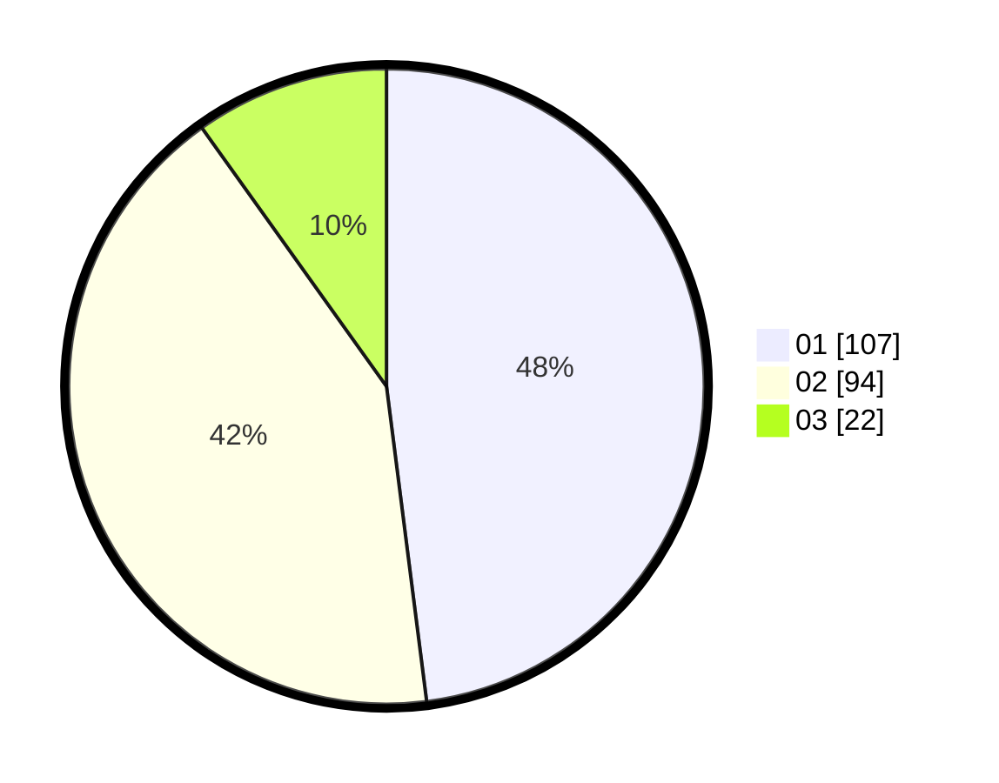

# Hasil

Hasil perolehan suara paslon dapat dilihat pada file paslon-01.txt, paslon-02.txt, dan paslon-03.txt.

Jika tidak ada, artinya data tersebut belum ada pada SIREKAP.

## Perolehan Suara

 * Paslon 01: **107**.
 * Paslon 02: **94**.
 * Paslon 03: **22**.

## Foto C Plano

https://sirekap-obj-formc.kpu.go.id/7a5d/pemilu/ppwp/31/73/08/10/03/3173081003094-20240214-204853--83b394f0-b384-44dc-b917-f56e018e88e9.jpg

https://sirekap-obj-formc.kpu.go.id/7a5d/pemilu/ppwp/31/73/08/10/03/3173081003094-20240214-205405--51ab7b08-83eb-4618-926a-98941d46f8ac.jpg

https://sirekap-obj-formc.kpu.go.id/7a5d/pemilu/ppwp/31/73/08/10/03/3173081003094-20240214-205633--fcce14df-8ee7-4c4b-a858-9ba73e5ae58e.jpg
