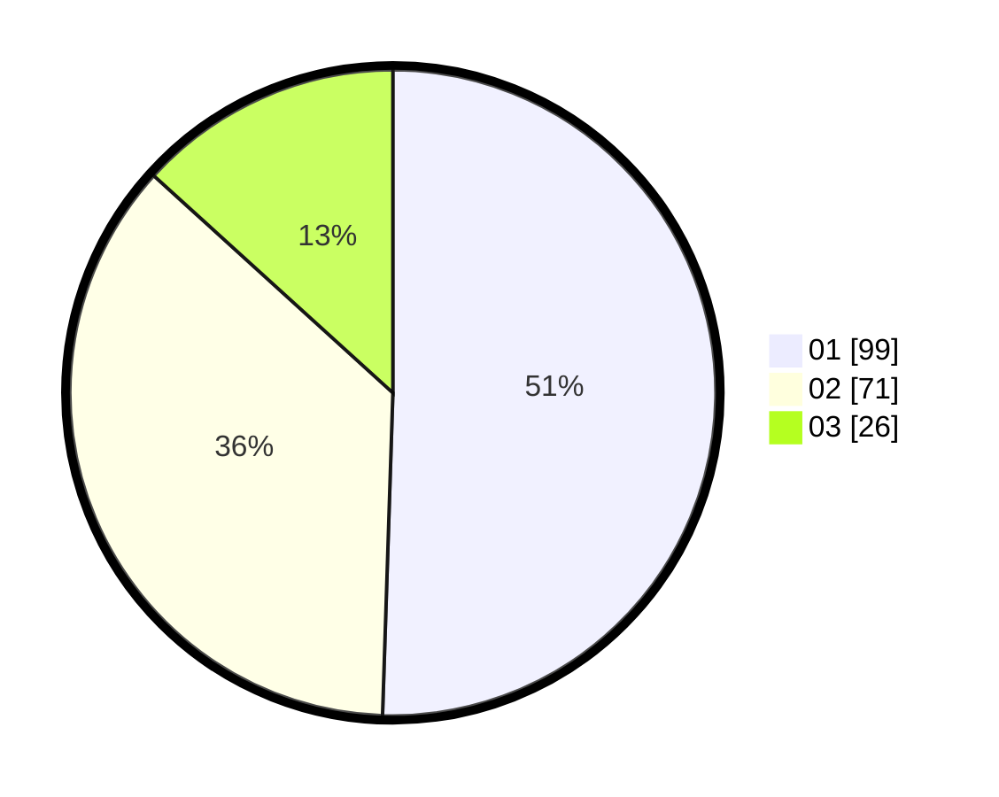

# Hasil

Hasil perolehan suara paslon dapat dilihat pada file paslon-01.txt, paslon-02.txt, dan paslon-03.txt.

Jika tidak ada, artinya data tersebut belum ada pada SIREKAP.

## Perolehan Suara

 * Paslon 01: **99**.
 * Paslon 02: **71**.
 * Paslon 03: **26**.

## Foto C Plano

https://sirekap-obj-formc.kpu.go.id/4fa9/pemilu/ppwp/31/73/08/10/03/3173081003096-20240214-193411--35d50e2d-8149-43b6-b758-f5edba560b32.jpg

https://sirekap-obj-formc.kpu.go.id/4fa9/pemilu/ppwp/31/73/08/10/03/3173081003096-20240214-195015--65c06e41-f20b-4482-b089-72e50ef8fd53.jpg

https://sirekap-obj-formc.kpu.go.id/4fa9/pemilu/ppwp/31/73/08/10/03/3173081003096-20240214-233101--927a8913-1868-4377-a319-22ddc5d3ac27.jpg
